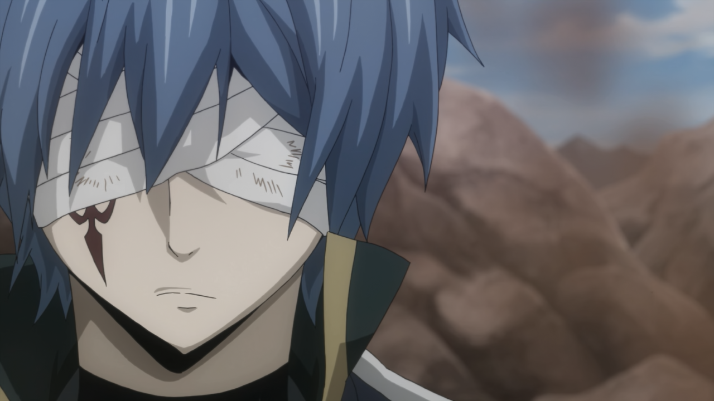
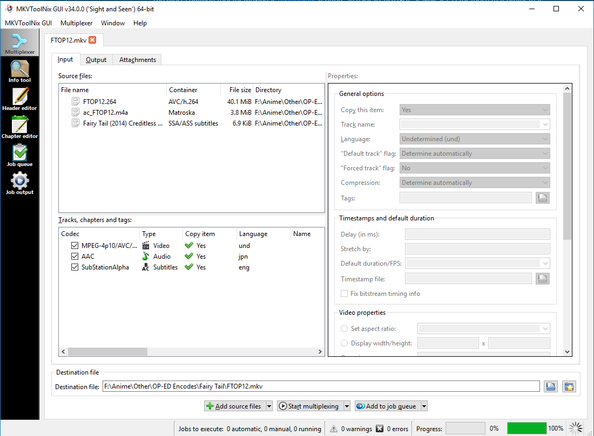
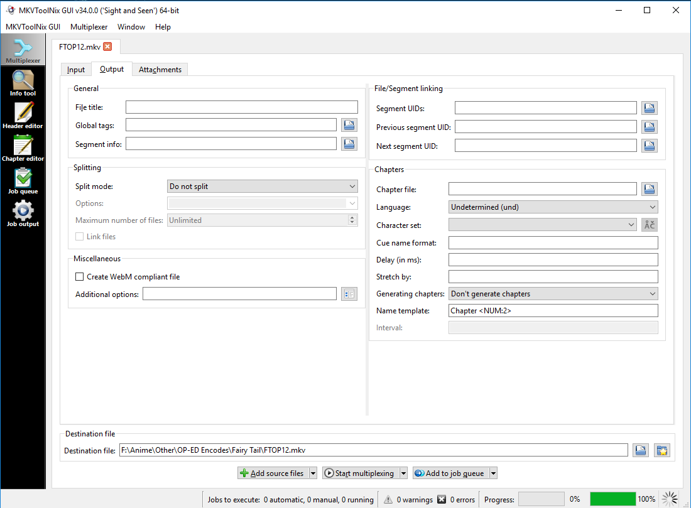
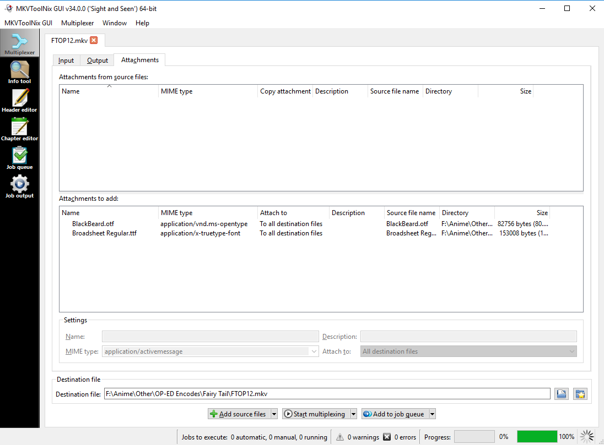
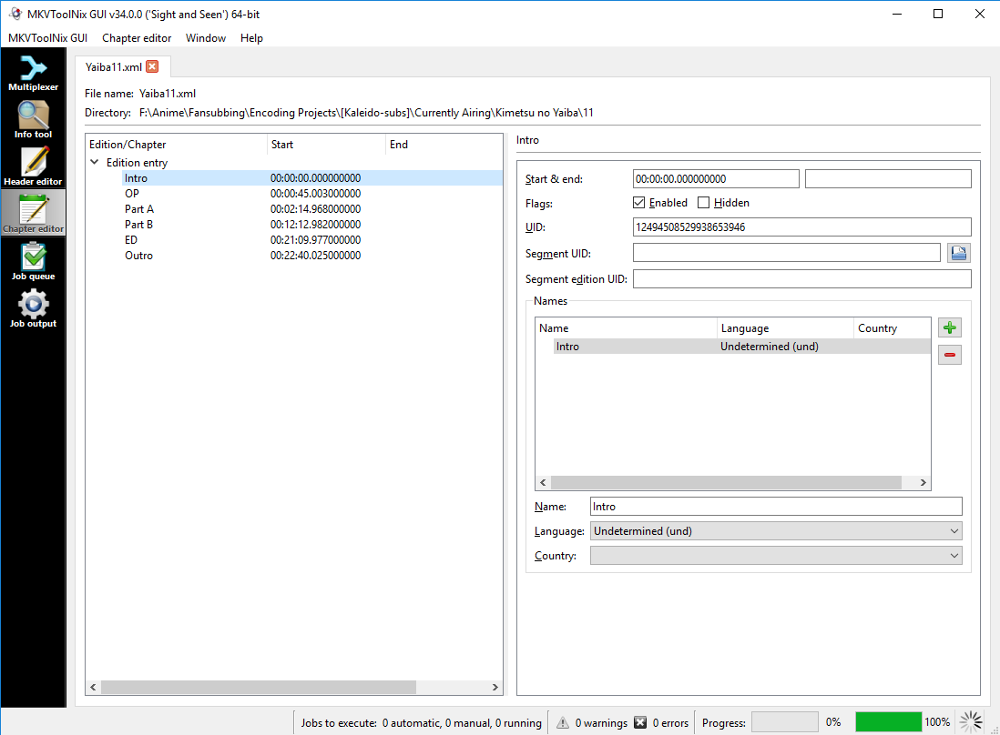

# Basics and General Workflow

## Preparation

It is important to have a good idea
of what you want the result of the encode
to be like.
What will your video source be?
What resolution should you encode it to?
Do you use AAC or FLAC?
8bit colors or 10bit colors?
All of these are things
that have to be accounted for
and decided early on.

Some groups have set standards.
For example, you may have a group
that always encodes their audio in AAC.
Others will always release their videos in 1080p.
Some may even mix it up
and use FLAC audio for 1080p releases,
but AAC for 720p.
They might even only go for
8bit colors in the latter case!
If you're unsure what standards a group has,
contact your group leader.

There are various sources
that are often used for the video.
You will most commonly work with websources
like Crunchyroll,
as those are easy to acquire,
or Blu-rays, for the improved quality and fixes.
As a beginner, you might not
have access to private trackers with BDMVs yet.
A good alternative until then
is to use the raws provided by groups like Reinforce:
those that have not been filtered,
just re-encoded from the BDMV.

## Writing the Script

In order to start filtering,
first you must learn how to write a VapourSynth script.

```Py
import vapoursynth
core = vs.core
```

First, you must import the VapourSynth module.
You can also import various other modules,
like the many "funcs"[^1] that people have written.
Here are some common examples:

```Py
import kagefunc as kgf
import fvsfunc as fvf
import havsfunc as haf
```

These will import various functions
that may prove useful for filtering,
like masks, descaling wrappers, anti-aliasing functions, etc.

Now, to start filtering,
we must first import a video clip.

```Py
src = core.ffms2.Source("source")
```
```Py
src = core.lsmas.LWLibavSource("source")
```

There are two common import filters available.
Those are L-SMASH and ffms2.
L-SMASH is typically used for m2ts files
(the kind you'll find in BMDVs),
while ffms2 is used for everything else.
The reason for this is that ffms2
can't accurately read m2ts files,
which L-SMASH can.
However, L-SMASH is slower than ffms2,
and some people prefer to be able to
index the source files faster.

It is common practice to call the source clip `src`.
This way it's easy to tell what the original video is,
and it can be referenced for some masks or for comparisons.

Let's now look at a couple of common filters
that you will find yourself using often.

```Py
src16 = fvf.Depth(src, 16)
```

The color depth of a clip
indicates the number of bits used
to give a pixel its color.
A lot of filters work with high bitdepths,
so this is typically set at the start of the script.
Your average `src` will be 8bit,
but you might occasionally run into 10bit sources as well.

```Py
trim = core.std.Trim(src, first=100, last=1000)
```
```Py
trim = src[100:1001]
```

`Trim` is used for trimming the video.
It's inclusive,
which means that it also adds the `last` frame given.
Another way to trim is by using Python Slices.
These are exclusive however,
so you need to take that into account.

Inclusive and exclusive work like this:

Let's say you have a number range.
This is what they'd look like with both methods:
```
Inclusive from 1 to 10:
1 2 3 4 5 6 7 8 9 10

Exclusive from 1 to 10:
1 2 3 4 5 6 7 8 9
```

Inclusive also **inclu**des
the final number in the given range,
whilst exclusive **exclu**des them.
Both of these have their pros and cons,
so it all comes down to preference.

```Py
scaled = core.resize.Spline36(src, width=1280, height=720)
```

`resize` has multiple "kernels"
that are used for [resampling](resampling.md#upsampling) the clip
to the given resolution.
Common resolutions are 1920x1080, 1600x900, 1280x720, 1024x576 and 848x480.
Nowadays most sources will be available in 1080p,
but there are advantages to downscaling,
like smaller filesizes.

You will often find grain or noise on a lot of sources.
You can get rid of that by denoising them.


Look at her hair. There is a lot of grain on there, but some people may prefer that to be smooth instead.

```Py
import mvsfunc as mvf

denoise = mvf.BM3D(src, sigma=[4,2])
```


There are many denoisers available to use,
and they all have their strong and weak points.
Some will have better detail retention,
whilst others are a lot faster.

Just be aware that getting rid of grain
will often result in more problems popping up,
like the very obvious banding in this case.

Banding is caused by gradients
breaking up during compression.
In this picture,
you can see the gradient breaking up
very clearly in her hair.
To fix this, you use a debanding filter.

```Py
import mvsfunc as mvf
import kagefunc as kgf

denoise = mvf.BM3D(src, sigma=[4,2])
deband = core.f3kdb.Deband(denoise, range=18, y=40, cb=32, cr=32, grainy=12, grainc=0, output_depth=16)
grain = kgf.adaptive_grain(deband, strength=0.1)
```


The banding is now less obvious,
and has been further hidden by adding grain.

Grain is something that some people like,
and others hate with a passion.
There are various ways that it can be used,
ranging from adding a particular mood to a scene
to preventing other artifacts from showing up.
It's also common for encoders to
add their own grain after denoising.



This frame looks fairly clean overall,
but the encoding may introduce some banding
in the darker areas of this frame.
To combat this, we're adding grain
to just the darker areas.

```Py
import kagefunc as kgf

grain = kgf.adaptive_grain(deband, strength=0.3, luma_scaling=8)
```


Another common issue is aliasing.
Aliasing an artifact that is commonly caused
by scaling or compression.


Note the windows to the left.
You'll want to use anti-aliasing filters
to deal with this.

```Py
import vsTAAmbk as taa

aa = taa.TAAmbk(src aatype='Eedi3', opencl=True)
```


There are a couple of different anti-aliasing filters,
some faster than others.
Try out lighter AA if you can first,
like `Nnedi3`.


## Encoding the Result

Now that the filtering has been applied,
it's time to encode the result.
There are two video codecs that are generally accepted nowadays,
and those are AVC/H264 and HEVC/H265.

For H264 encodes,
you should be using [x264](x264).
For x265, [x265](x265).
Both are also included in ffmpeg,
but for this guide
we will be using the standalone programs.

There are various settings you will have to tweak
to get your desired results.

Here's a couple of common settings:
* preset
* keyint
* crf
* aq-strength
* psy-rd
* output-depth
* output-csp

The preset sets a lot of settings for you.
You'll almost always want to run `--preset veryslow` for anime.

The keyint sets how often keyframes will be created.
For full episodes those are usually
set to `--min-keyint framerate` and `--keyint framerate*20` or `framerate*30`,
with "framerate" being the framerate of the video.
For example, if your video is 23.976fps (most common for anime),
`min-keyint` would be set to 24 and `keyint` would be set to 480 or 720.

The **C**onstant **R**ate **F**actor sets the constant quality option.
The default of `--crf 23` is way too low for anime,
and going that high will result in artifacting popping up
more often than not.
For values to use, this varies per encoder.
The commonly suggested values are as follows (lower is better):

x264:
* 480p: crf 18 or 19
* 720p: crf 15 or 16
* 1080p: crf 16

x265:
* 480p:
* 720p:
* 1080p:

How high or low you go will vary depending on the show
and how much you care for the final filesize versus the quality.
Slice of Life anime can usually get away with higher values,
whilst action anime or anime with a lot of darker scenes
benefit from a lower crf.

aq-strength is a setting that can drastically change the perceived quality.
Higher values do a better job of retaining gradients at the cost of causing ringing,
while lower values preserve edges better at the cost of causing banding.
It is generally adviced to start with `--aq-strength 0.70`
and tweak according to your source.

psy-rd sets the Psy-RDO and Psy-Trellis.
For an explanation on how it works, read [this doom9 post](psy-rd_post).
For anime you usually go with `--psy-rd 0.72:0`,
and tweak the Psy-RDO settings (first value),
while generally leaving the Psy-Trellis settings (second value) alone.
Higher values can help with better grain retention.

For newer versions of x264,
it is important to set the `--output-depth 10` flag
when encoding in 10bit colordepth.
Otherwise it will encode in 8bit.
Likewise, when encoding in a 4:4:4 colorspace,
make sure you set `--output-csp i444`.

With those things in mind,
this is what a common command looks like:

```sh
$ vspipe FTOP12.vpy --y4m - | x264 --demuxer y4m -o FTOP12.264 - --preset veryslow --crf 14 --keyint 240 --min-keyint 23 --ref 16 --bframes 16  --aq-mode 3 --aq-strength 0.70 --qcomp 0.70 --no-dct-decimate --no-fast-pskip --psy-rd 0.72:0.0 --output-depth 10
```

Editors for VapourSynth usually have inbuilt support
for encoding scripts you wrote.
Use `%encode --y4m <clip_variable>` in Yuuno
or the GUI provided by VSEdit.


## Transcoding Audio

Before getting into transcoding audio,
it is important to learn about
the difference between
"lossy" and "lossless" compression.

If you're transcoding in a lossy format,
you are chucking away data
deemed unnecessary by the encoder.
This is the kind of encoding you do with video,
however it can also be done with audio.
The benefit of this is that
you'll end up with smaller files,
however this might cause a reduction in quality.

Lossless compression is a form of compression where,
upon decoding, none of the data is lost.
This is fantastic for preservation.
However, the results can also turn up
pretty big, very quickly.

Picking between lossy and lossless encoding
comes down to what you prefer.
Be it having smaller filesizes
with possibly next to no perceivable difference from the original,
or bigger files with as much information as possible.

You should never encode from a lossy audio codec
to a lossless one, though.
This will only increase the filesize for zero gain.
Likewise, you want to avoid lossy-to-lossy encoding
as much as you possibly can.
The more data you chuck away,
the worse it will sound,
because of [generational loss][generational_loss].

There are generally three audio codecs
that you will use:

* FLAC
* AAC
* opus

FLAC is a **F**ree **L**ossless **A**udio **C**odec.
This is the go-to for lossless audio encoding,
as it's better at compression
than other lossless codecs (like PCM).
You can encode to fLAC using ffmpeg
with the following command:

`$ ffmpeg -i input.wav output.flac`

You can also change the compression level.
What this does is that it will try to compress
the audio file even further than with default settings.
However, this will take more resources to encode *and* decode.
Levels range from 0 to 12.

`$ ffmpeg -i input.wav -compression_level 12 output.flac`

To show the difference in filesize,
I will use [this](audio/Fate_Zero_OP2_(original).wav) audio file
as an example.
This was ripped straight from the Fate/Zero blu-rays.
The first part is the filesize in bytes,
and the second is the name of the file.
The number in the brackets
indicates the `compression_level` used.

```
26.811.464 Fate_Zero_OP2_(original).wav
20.373.919 Fate_Zero_OP2_(00).flac
20.324.721 Fate_Zero_OP2_(01).flac
20.313.009 Fate_Zero_OP2_(02).flac
19.672.150 Fate_Zero_OP2_(03).flac
19.602.556 Fate_Zero_OP2_(04).flac
19.600.585 Fate_Zero_OP2_(05).flac
19.599.423 Fate_Zero_OP2_(06).flac
19.675.564 Fate_Zero_OP2_(07).flac
19.526.067 Fate_Zero_OP2_(08).flac
19.585.149 Fate_Zero_OP2_(09).flac
19.525.085 Fate_Zero_OP2_(10).flac
19.509.644 Fate_Zero_OP2_(11).flac
19.469.016 Fate_Zero_OP2_(12).flac
```

The difference between them for something as short as an Opening
isn't that significant,
but that changes
once you start looking at full episodes:

```
458.233.964 KaguyaBD_01_(original).wav
314.660.781 KaguyaBD_01_(00).flac
312.773.683 KaguyaBD_01_(01).flac
312.486.815 KaguyaBD_01_(02).flac
300.712.094 KaguyaBD_01_(03).flac
299.806.321 KaguyaBD_01_(04).flac
299.658.920 KaguyaBD_01_(05).flac
299.606.279 KaguyaBD_01_(06).flac
300.119.565 KaguyaBD_01_(07).flac
298.832.315 KaguyaBD_01_(08).flac
299.172.074 KaguyaBD_01_(09).flac
298.773.829 KaguyaBD_01_(10).flac
298.468.836 KaguyaBD_01_(11).flac
297.952.201 KaguyaBD_01_(12).flac
```

We can drastically reduce the filesize
by making use of `-sample_fmt s16`.
Not a lot of anime have true 24bit audio,
and the vast majority of people
wouldn't be able to tell a difference regardless.
Some encoders prefer encoding FLAC in 16bit instead
for this very reason.

```
458.233.964 KaguyaBD_01_(original).wav
163.088.307 KaguyaBD_01_(00)_16bit.flac
161.313.003 KaguyaBD_01_(01)_16bit.flac
161.051.956 KaguyaBD_01_(02)_16bit.flac
149.929.246 KaguyaBD_01_(03)_16bit.flac
149.084.733 KaguyaBD_01_(04)_16bit.flac
148.909.370 KaguyaBD_01_(05)_16bit.flac
148.857.694 KaguyaBD_01_(06)_16bit.flac
148.848.250 KaguyaBD_01_(07)_16bit.flac
148.149.100 KaguyaBD_01_(08)_16bit.flac
148.088.813 KaguyaBD_01_(09)_16bit.flac
148.080.093 KaguyaBD_01_(10)_16bit.flac
147.368.127 KaguyaBD_01_(11)_16bit.flac
147.327.448 KaguyaBD_01_(12)_16bit.flac
```

AAC serves as a fantastic middleground
between FLAC and opus.
AAC is a lossy audio codec,
which results in overall smaller encodes
at the cost of it throwing away some data.

For encoding in AAC it is always recommended
to use [qaac](qaac) (the Apple AAC encoder)
over the AAC encoder supplied with ffmpeg.
It does a much better job of preserving the perceptional quality
over all its competitors,
and is thus the go-to for people that encode in AAC.

The options you'll used most is `-V`.
`-V` sets the true Variable Bitrate mode,
allowing qaac free reign in deciding
what it believes to be the best bitrate to encode to.

The most common command looks like this:

`$ qaac input.wav -V 127`

Let's compare the filesizes between the FLAC encodes we did before.

```
26.811.464 Fate_Zero_OP2_(original).wav
19.469.016 Fate_Zero_OP2_(12)_24bit.flac
10.898.384 Fate_Zero_OP2_(12)_16bit.flac
 3.886.831 Fate_Zero_OP2_(qaac).m4a
```
```
458.233.964 KaguyaBD_01_(original).wav
297.952.201 KaguyaBD_01_(12)_24bit.flac
147.327.448 KaguyaBD_01_(12)_16bit.flac
 54.191.826 KaguyaBD_01_(qaac).m4a
```

The final commonly-used audio codec is opus.
Opus is used for web audio,
as it is designed for
low-latency, low-complexity audio compression.
This makes it great for "mini" releases.
You can encode to qaac through ffmpeg:

`$ ffmpeg -i input.wav output.opus`

Or through [Opus-tools](opus-tools)
if you don't know
how to compile ffmpeg with opus support:

`$ opusenc input.wav output.opus`

Unlike qaac, opus works with a constant bitrate.
You can set it with `-b:a` in ffmpeg
and `--bitrate` in opusenc.
For anime, a bitrate of 128k is usually transparent
for both dialogue and music.

`$ opusenc input.wav --bitrate 128k output.opus`

## Muxing

The most common tool for muxing is [mkvtoolnix](mkvtoolnix).
It offers an easy-to-use GUI,
as well as CLI for those that prefer that.

The input tab is where you drag most of your components.
This can be video, audio, and subtitles.
You can also set the languages
and additional settings for every track,
like for example delays, track names, playback fps, etc.



The output tab allows you to change the output.
You can for example trim the output,
set the segments, file title, etc.
This is also where you load in the chapters
if your video has any.



The attachments tab is where you add attachments
to the output video.
These are generally fonts.



The Chapter Editor allows you to create and edit chapters.
These are used to skip to certain parts of the video,
like for example the Opening.



For CLI, you can do a simple mux with the following command:

`$ mkvmerge -o output.mkv input_video.264 input_audio.m4a`

For a list of all settings,
check the [documentation](mkvmerge_docs).

***

[^1]: "funcs" are a combination of wrappers written by people to perform different tasks.
Most of these can be found in the [VapourSynth Database][vsdb]

[vsdb]: http://vsdb.top/
[generational_loss]: https://en.wikipedia.org/wiki/Generation_loss
[qaac]: https://github.com/nu774/qaac
[opus-tools]: http://www.opus-codec.org/downloads/
[mkvtoolnix]: https://mkvtoolnix.download/
[mkvmerge_docs]: https://mkvtoolnix.download/doc/mkvmerge.html
[x264]: https://www.videolan.org/developers/x264.html
[x265]: http://x265.org/
[psy-rd_post]: https://forum.doom9.org/showthread.php?t=138293