# Descaling

Among the many tools available in an encoder's arsenal,
the ability to descale might arguably be one of the best.
But what does descaling actually mean?
In what way does it differ from normal downscaling?
How do you actually descale properly?
This guide will explain the groundwork for you
to start descaling effectively.

## Descaling vs. Downscaling

What the difference between downscaling and descaling is
is a question that gets asked fairly frequently.
Simply put,
downscaling is the act of resizing an image
to a smaller resolution than the original image,
while with descaling you are actively reversing the math
applied to an upscale,
reconstructing the original image before upscaling
(which coincidentally also means you get a smaller image).

For a more thorough explanation on the intrinsics of descaling,
please refer to the [vapoursynth-descale Github page][vapoursynth-descale].

Descaling is generally the preferred method
of handling upscaled content whenever possible.
When performing a simple downscale,
information will be lost in the process.
A proper descale will, on the other hand,
(theoretically) preserve all the *actual* detail in an image.

That said, if you can't perform a good descale,
you will usually end up with haloing/ringing artifacting,
as illustrated below:

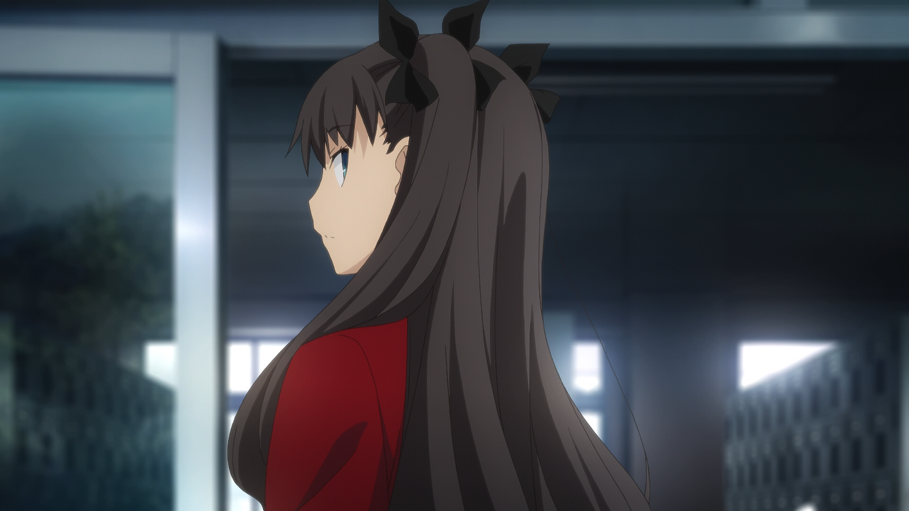

<div class="warning box"><p>
Only descale if you can be sure,
beyond reasonable doubt,
that you have figured out the correct resolution and kernel.
</p></div>


[vapoursynth-descale]: https://github.com/Irrational-Encoding-Wizardry/vapoursynth-descale

# Discerning the native resolution

The first step to descaling is to figure out
what the native resolution of a frame is.
One way to do this is by descaling to a bunch of resolutions,
upscaling the descaled image with the same kernel,
and comparing the two.
The artifacts created by descaling to a wrong resolution
are generally more obvious than
the artifacts created by using the wrong kernel.
Luckily for us,
there's already a tool out there
you can use for this.

[getnative.py][getnative] is a common tool
used for figuring out the native resolution of an image.
It will return a graph showcasing all the resolutions
it tried to descale to,
as well as a txt file
with all the relative errors listed.
Here's an example:

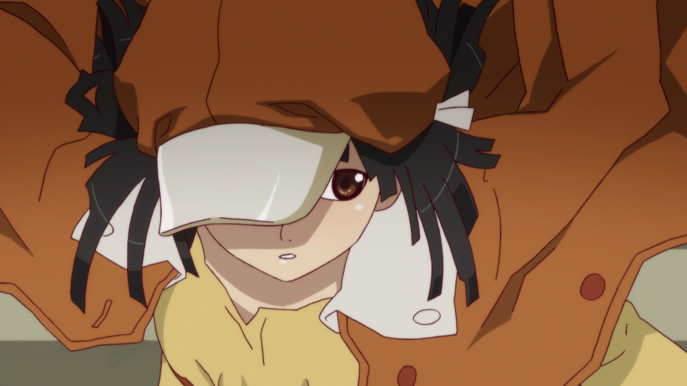
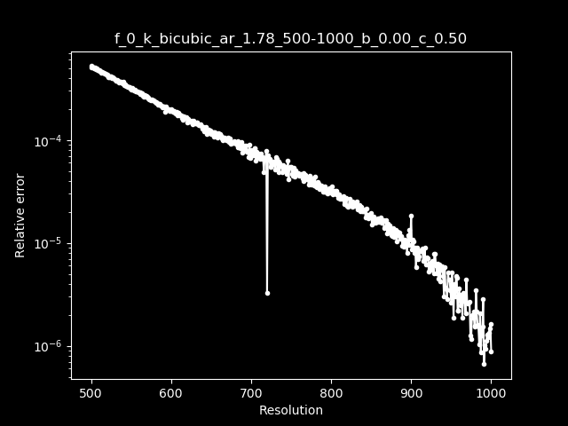

What you want to look out for are very clear spikes.
You can spot one of those here,
pointing towards a height of 720.
When trying to run getnative,
you ideally want to get a relatively bright frame
with very clearly defined lineart
and as little effects or filtering applied to it,
like for example blur or glow.

If you've got a graph without any clear spikes,
it's usually a bad idea to try descaling that.
It's likely that you're either working with native 1080p content,
an already-descaled encode,
or a source that has been too warped to properly descale.

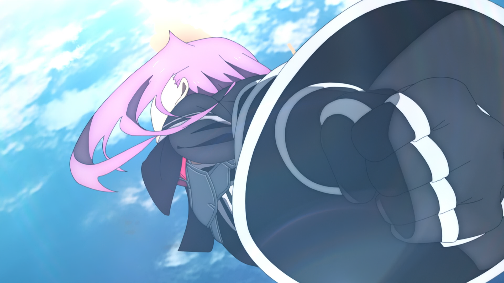
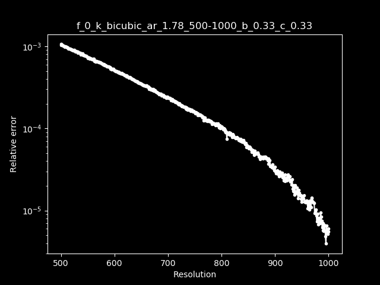

Also of note is that you should be careful
to not pick a frame with credits to run getscaler on.
Credits are usually added at the very end,
after the clip has already been upscaled.
Those will need to be handled separately.

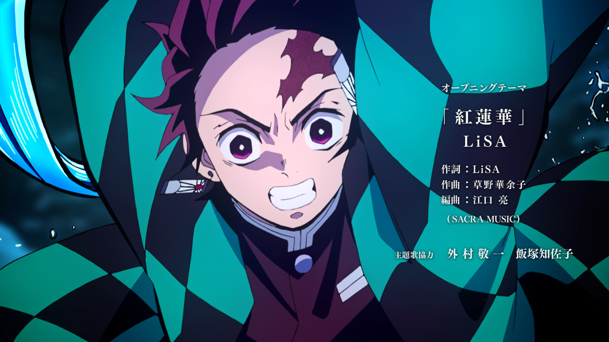
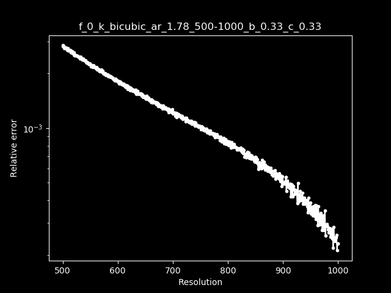

And last but not least,
we have letterboxing.
Letterboxing is what we call the black bars surrounding the video.
As an added bonus,
this example is also from a blu-ray release
that was brutally post-processed,
making it impossible to descale.

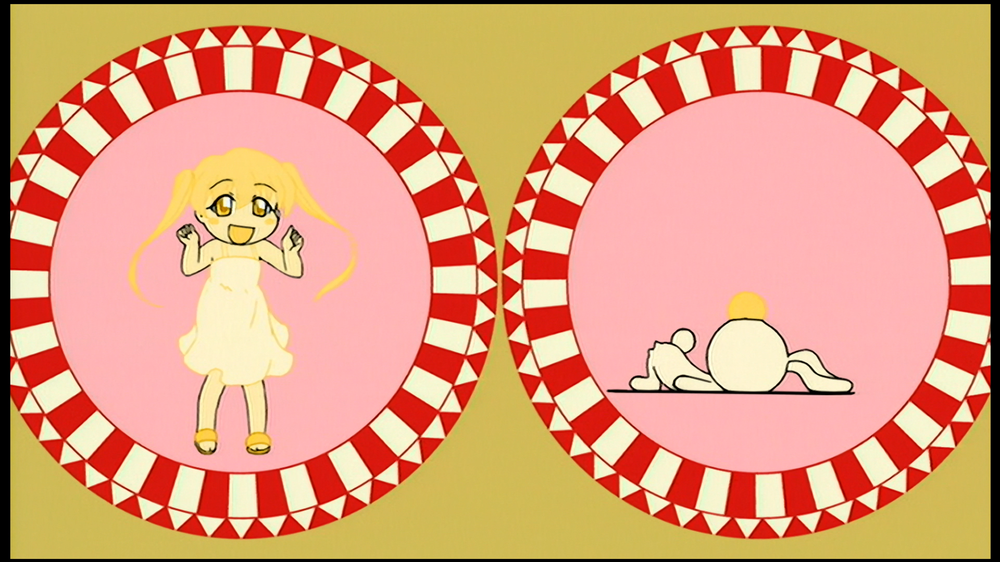
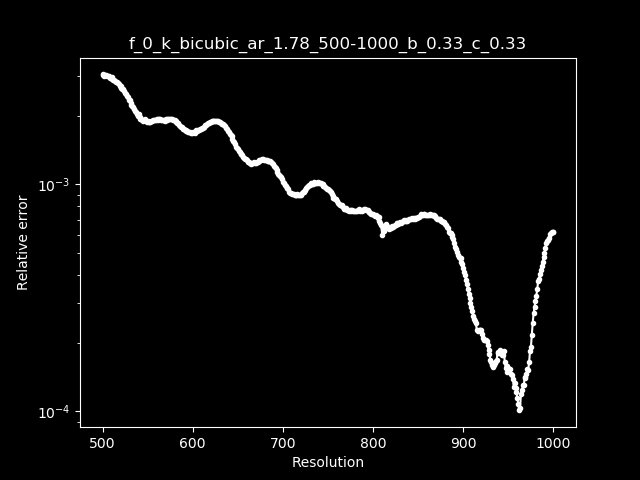

[getnative]: https://github.com/Infiziert90/getnative

# Filterchains

Once you've figured out the native resolution,
you can move on to the actual descaling.
There's two common ways to do this.
The first one is by using [descale][descale].
The other is by using `invks` from [fmtc][fmtc].
For convenience's sake,
we'll be keeping it to just `descale` for this guide.

There are a couple very common kernels
used in anime production:
* Bilinear
* Bicubic b=1/3, c=1/3 (Mitchell-Netravali)
* Bicubic b=0, c=0.5 (Catmull-Rom)

Occasionally, although rare,
you may also run into the following kernels:
* Lanczos taps=3
* Lanczos taps=4
* Spline16
* Spline36
* Bicubic b=1, c=0 (B-Spline)
* Bicubic b=0, c=0 (Hermite)
* Bicubic b=0, c=0 (Hermite)
* Bicubic b=0.3782, c=0.3109 (Robidoux)
* Bicubic b=0.2620, c=0.3690 (Robidoux Sharp)
* Bicubic b=0.6796, c=0.1602 (Robidoux Soft)

The most reliable way to discern
which kernel was used is by descaling the clip,
upscaling it again with the same kernel,
and then comparing it with the original frame.
Here is an example script using `compare` from `lvsfunc`
to easily compare frames from two clips:

```py
import lvsfunc as lvf

clip = core.lsmas.LWLibavSource(r"PATH/TO/VIDEO.m2ts")
clip = fvf.Depth(clip, 32) # Important to note: descale requires a GRAYS clip (or 444, but don't do that).

clip_y = core.std.ShufflePlanes(clip, 0, vs.GRAY)
descaled = core.descale.Debicubic(clip_y, width=1280, height=720, b=1/3, c=1/3)
reupscaled = core.resize.Bicubic(descaled, width=1920, height=1080, filter_param_a=1/3, filter_param_b=1/3)
merged = core.std.ShufflePlanes([reupscaled, clip], [0, 1, 2], vs.YUV)

comp = lvf.compare(clip, merged)
comp.set_output()
```

The most reliable way to check for differences is
by zooming in 4x with Nearest Neighbor
and switching between the frames
with the left and right arrow buttons.
You can enable the zoom here:

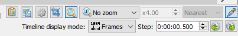

Clip "No zoom" and select "Fixed ratio".
You can set the zoom level next to it,
and the scaler used next to that.
Make sure to set it to Nearest!

Figuring out what to look out for
is a case of trial and error.
The best thing to keep an eye on
is lineart as well as small detail like stars.
It isn't uncommon for noise to become weaker after a rescale
(since that's usually added after upscaling, too),
so try not to be too distracted by that.

[descale]: https://github.com/Irrational-Encoding-Wizardry/vapoursynth-descale
[fmtc]: https://forum.doom9.org/showthread.php?t=166504

# Re-scaling

A fairly common practice is
to upscale the descaled clip to a standard resolution whenever possible
(if it isn't already one, like for example 720p).
There's a couple scalers that are generally recommended.

The most common scaler for re-scaling is [nnedi3_rpow2][nnedi3_rpow2].
It returns consistently good-looking lines
without damaging other detail.
Since it's an image doubler,
it's important to remember that you'll have to scale it down afterwards.

```py
from nnedi3_rpow2 import nnedi3_rpow2

upscaled = nnedi3_rpow2(descaled, width=1920, height=1080)
```

Similarly, [nnedi3_resample][nnedi3_resample] is also used by some people
and might give better results
with some additional tweaking of the settings.
Like nnedi3_rpow2, it's an image doubler
and needs to be downscaled after.

```py
from nnedi3_resample import nnedi3_resample

upscaled = nnedi3_resample(descaled, width=1920, height=1080)
```

Of course you can still opt for more generic scalers,
like Spline36 or Lanczos.

```py
upscaled = core.resize.Spline36(descaled, width=1920, height=1080)
```
```py
upscaled = core.resize.Lanczos(descaled, width=1920, height=1080, filter_param_a=3)
```

A couple more extreme examples
would be using [waifu2x][waifu2x] or [upscaled_sraa][upscaled_sraa]
to upscale it back to 1080p.
These are far more destructive
and take much longer,
but depending on your source,
might yield overall better results.

```py
upscaled = core.caffe.Waifu2x(descaled, noise=-1, scale=2, model=6, cudnn=True)
upscaled = core.resize.Spline36(upscaled, width=1920, height=1080)
```
```py
import lvsfunc as lvf

upscaled = lvf.upscaled_sraa(descaled, h=1080)
```

[nnedi3_rpow2]: https://github.com/darealshinji/vapoursynth-plugins/blob/master/scripts/nnedi3_rpow2.py
[nnedi3_resample]: https://github.com/mawen1250/VapourSynth-script/blob/master/nnedi3_resample.py
[waifu2x]: https://github.com/HomeOfVapourSynthEvolution/VapourSynth-Waifu2x-caffe
[upscaled_sraa]: https://github.com/Irrational-Encoding-Wizardry/lvsfunc/blob/master/lvsfunc.py#L515-L582

# Handling native 1080p content

When descaling,
it's important to be wary of native 1080p elements.
A common example of this is credits,
which are generally added after upscaling.
These will require being masked.
The easiest way to do this
is by using the re-upscaled clip
used for checking for the kernel
and using an expression to get the absolute difference between the two
and then tweaking the mask further to properly catch everything.
Then the mask is binarized
so it doesn't catch every small extra bit
it happened to catch.
This should work fine for most of the frame
(given that you descaled it correctly).
Here is an example of that:

```py
import vsutil
import kagefunc as kgf

clip_y = vsutil.get_y(clip)
descaled = core.descale.Debicubic(clip_y, 1550, 872, b=1/3, c=1/3)
upscaled = core.resize.Spline36(descaled, 1920, 1080, filter_param_a=1/3, filter_param_b=1/3)
credit_mask = core.std.Expr([clip_y, upscaled], 'x y - abs')
credit_mask = kgf.iterate(credit_mask, core.std.Maximum, 4)
credit_mask = kgf.iterate(credit_mask, core.std.Inflate, 2)
credit_mask = credit_mask.std.Binarize(0.05)

rescaled = nnedi3_resample(descaled, 1920, 1080)
merged = core.std.MaskedMerge(rescaled, planes[0], credit_mask)

merged = core.std.ShufflePlanes([merged, clip], [0, 1, 2], vs.YUV)
```

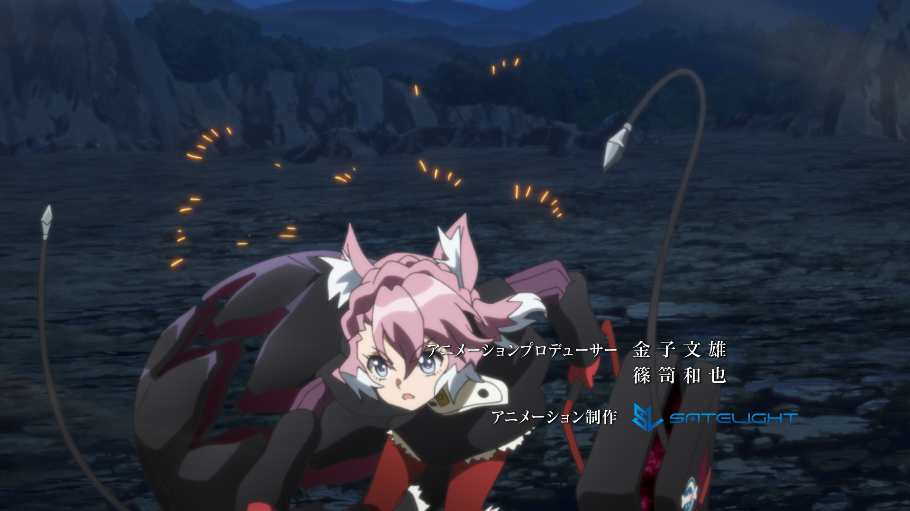
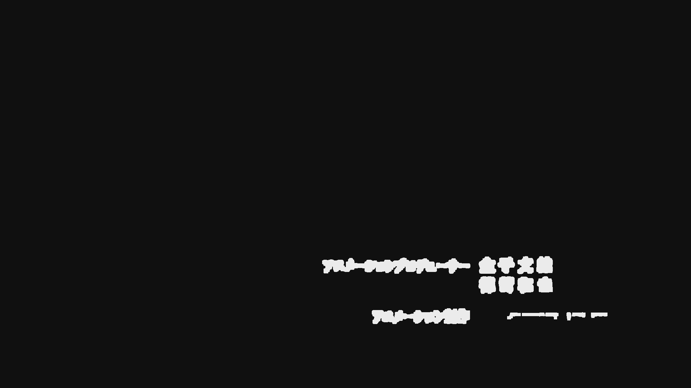


This can also be done when descaling
to a resolution that you plan to stick with.
Since the credits will still be messed up,
you will need to replace them with a downscaled clip.

```py
y, u, v = vsutil.split(clip)
descaled = core.descale.Debicubic(y, 1280, 720, b=0, c=1/2)
upscaled = core.resize.Bicubic(descaled, 1920, 1080, filter_param_a=0, filter_param_b=1/2)
downscaled = core.resize.Spline36(y, 1280, 720)
credit_mask = core.std.Expr([y, upscaled], 'x y - abs')
credit_mask = kgf.iterate(credit_mask, core.std.Maximum, 6)
credit_mask = kgf.iterate(credit_mask, core.std.Inflate, 2)
credit_mask = core.std.Binarize(credit_mask, 0.05)
credit_mask = core.resize.Spline36(credit_mask, 1280, 720)

y_scaled = core.std.MaskedMerge(descaled, downscaled, credit_mask)
u_scaled = core.resize.Bicubic(u, 1280, 720)
v_scaled = core.resize.Bicubic(v, 1280, 720)

merged = core.std.ShufflePlanes([y_scaled, u_scaled, v_scaled], [0, 0, 0], vs.YUV)
```

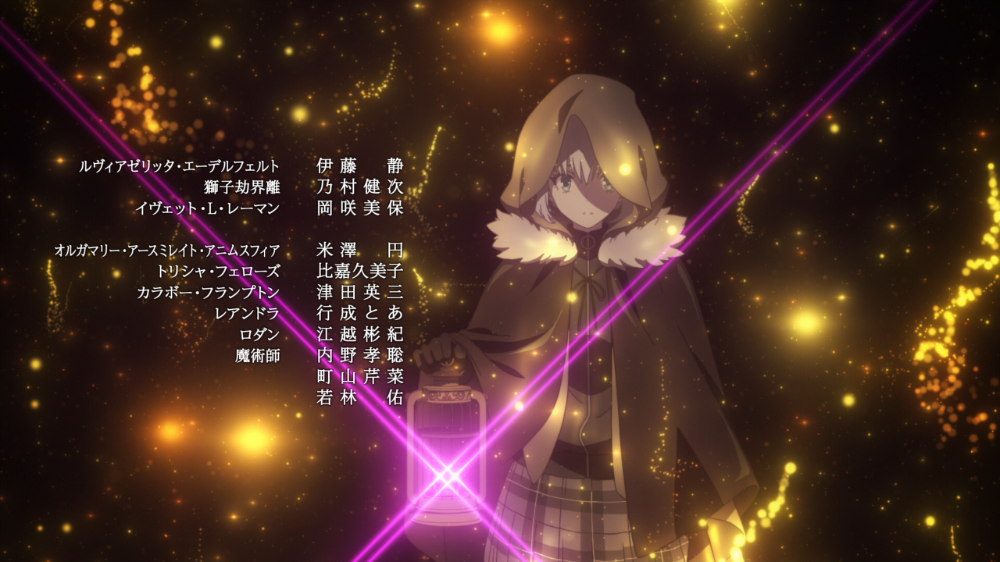
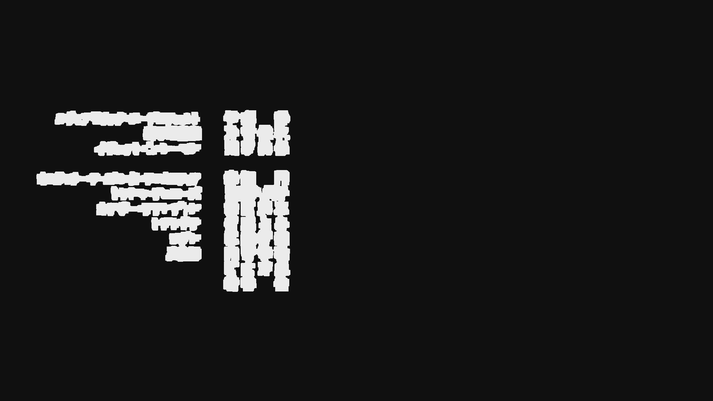
