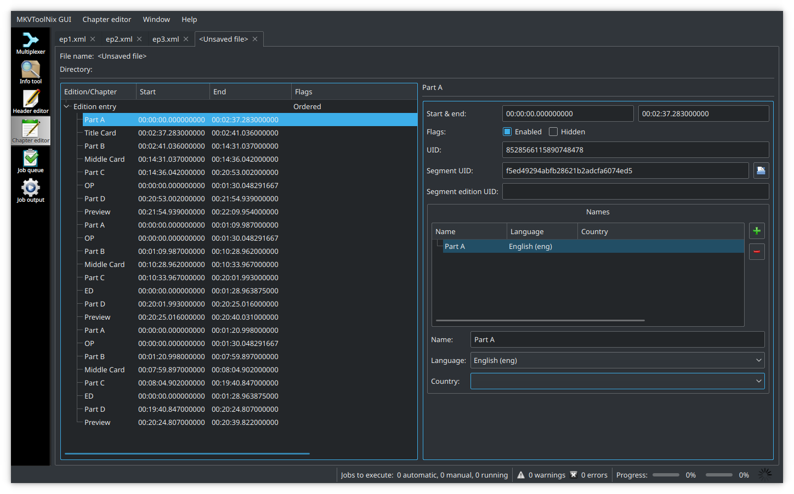
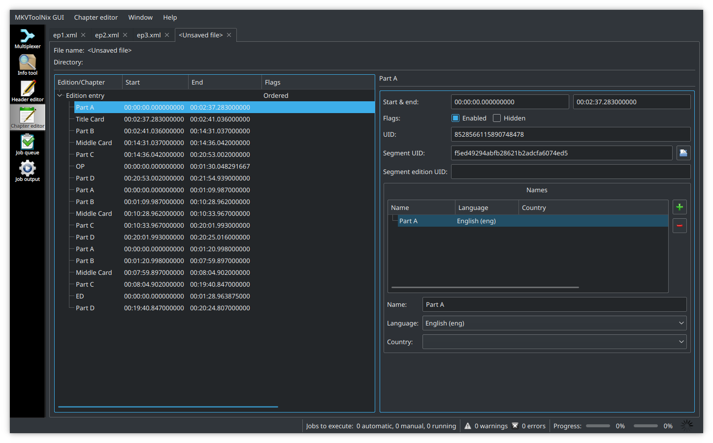

# Mastroka Container Tricks

*Disclaimer: this page assumes some basic knowledge of the mastroka container,
python,
and VapourSynth.*


## Background and Preparation

The Mastroka Media Container is an open source,
open standard multimedia container
that is heavily used in the fansubbing scene.
Mastroka video, or `.mkv` files
are the standard for soft-subbed releases
as they allow for multiple subtitles tracks and chapters
which are a somewhat unique feature to the container.
The MPEG-4 Part 14 or MP4 is another container format
but it is limited in its usefulness for fansubbing.

The following steps will require
VapourSynth,
[MKVToolNix GUI + CLI][toolnix],
a tool to demux transport stream files (i.e. [tsMuxeR][]),
and [FFmpeg][] to be installed
(or readily available as binaries).
A [mastroka-friendly player][mk-playback], preferably [MPC-HC][] or [mpv][],
will also be required for testing the files.

The examples will be using pre-made subtitle tracks,
a BDMV source,
[VSEdit](preparation.md#the-editor),
an [audio-cutting python script][acsuite.py],
and a [script to change frame numbers into timestamps][f2ts.py].

What we will be doing:
1. Trimming audio to match our VapourSynth video trims
1. Creating mkv files from individual tracks
1. Creating chapters for said files
1. Creating virtual timelines with ordered chapters
1. Using multiple audio codecs in the same 'apparent file'
1. Using editions to change between NCOP and OP
1. Creating a playall file with ordered chapters

*Most of the example files can be found in [this repository][mkvtricks]
if you'd like to follow along.*

[toolnix]: https://mkvtoolnix.download/downloads.html
[tsMuxeR]: https://www.videohelp.com/software/tsMuxeR
[FFmpeg]: https://ffmpeg.zeranoe.com/builds/
[mk-playback]: https://github.com/hubblec4/Matroska-Playback/blob/e48149b500ce80c38ebc07ccf8f74f8af45e89b2/src/PlayerOverview.md
[MPC-HC]: https://github.com/clsid2/mpc-hc/releases
[mpv]: https://mpv.io/installation/
[acsuite.py]: https://github.com/OrangeChannel/acsuite/blob/04194ad6d4e65e491b5c09219d3f9e832651f2c0/acsuite.py
[f2ts.py]: https://gist.githubusercontent.com/OrangeChannel/330a032e4d6cf9265b8b007c41112937/raw/frame-to-timestamp.py
[mkvtricks]: https://github.com/OrangeChannel/mastroka-tricks-files


## Starting with trimming the video

Obviously, the goal here is not to teach how to encode,
but provided are examples of trims that may need to be made
to cut the OP/ED out of an episode,
and possibly any other unwanted frame-ranges
(some blu-ray streams have a silent black screen at the end,
which should be cut out).

Starting with four files,
our first step is to trim the main episodes out.
This requires knowing the frame ranges, shown below.
Second, we will crop out the NCOP/NCED files
as they also have unwanted frames at the end.

```py
import vapoursynth as vs
core = vs.core

bdmv =  core.lsmas.LWLibavSource(r'/BDMV/STREAM/00003.m2ts')
bdmv2 = core.lsmas.LWLibavSource(r'/BDMV/STREAM/00004.m2ts')
bdmv3 = core.lsmas.LWLibavSource(r'/BDMV/STREAM/00005.m2ts')
bdmv_NCOP = core.lsmas.LWLibavSource(r'/BDMV/STREAM/00007.m2ts')
bdmv_NCED = core.lsmas.LWLibavSource(r'/BDMV/STREAM/00008.m2ts')

ep1 = bdmv[:30042]+bdmv[32201:34046]
# 0-30041, 32201-34045 is main episode 1
ep2 = bdmv2[:1678]+bdmv2[3837:30978]+bdmv2[33111:34023]
# 0-1677, 3837-30977, 33111-34022 is main episode 2
ep3 = bdmv3[:1942]+bdmv3[4104:30474]+bdmv3[32609:34023]
# 0-1941, 4104-30473, 32609-24022 is main episode 3

op = bdmv[30042:32201] # the first time the OP plays is during episode 1
                       # 30042-32200 is the OP
ed = bdmv2[30978:33111] # the first time the ED plays is during episode 2
                        # 30978-33110 is the ED
ncop = bdmv_NCOP[:2158] # 0-2157 is the NCOP
nced = bdmv_NCED[:2133] # 0-2132 is the NCED
```

Assuming the codec used is h.264/AVC,
this will result in the following files:

- `vid_ep1.264`
- `vid_ep2.264`
- `vid_ep3.264`
- `vid_OP.264`
- `vid_ED.264`
- `vid_NCOP.264`
- `vid_NCED.264`


## Trimming the audio + generating chapters

In order to start the audio processing,
we first need to extract the audio track from the transport stream files.
Using the tsMuxeR GUI set to *demux* mode,
grab the likely pcm or dts audio streams,
only changing the extension.

- `00003.m2ts` > `00003.wav`
- `00004.m2ts` > `00004.wav`
- `00005.m2ts` > `00005.wav`
- `00007.m2ts` > `00007.wav`
- `00008.m2ts` > `00008.wav`

Now, either in a new python instance
or from within our VapourSynth script above,
we will use `acsuite.py` to trim our audio,
and generate chapter timings.
(The lines should be commented out when not in use.
If running from within VSEdit,
you must name and save the script first if you do not specify full paths
for the `outfile` and/or `chapter_file`.)

**Note:** the frame numbers used in `ac.octrim(...)` and `ac.eztrim(...)`
are from the untrimmed source clips.
The exact syntax is explained in the docstrings for `acsuite.py`.

```py
...
import acsuite
ac = acsuite.AC()

afile =  r'/BDMV/STREAM/00003.wav' # 260.2 MiB
afile2 = r'/BDMV/STREAM/00004.wav' # 260.0 MiB
afile3 = r'/BDMV/STREAM/00005.wav' # 260.0 MiB
afile4 = r'/BDMV/STREAM/00007.wav' # 16.7 MiB
afile5 = r'/BDMV/STREAM/00008.wav' # 16.5 MiB

chap = [(0, 'Part A'), (3771, 'Title Card'),(3861, 'Part B'), (20884, 'Middle Card'), (21004, 30041, 'Part C'), (32201, 'Part D'), (33686, 34045, 'Preview')]
chap2 = [(0,1677,'Part A'),(3837,'Part B'),(17239,'Middle Card'),(17359,30977,'Part C'),(33111,'Part D'),(33663,34022,'Preview')]
chap3 = [(0,1941,'Part A'),(4104,'Part B'),(13668,'Middle Card'),(13788,30473,'Part C'),(32609,'Part D'),(33663,34022,'Preview')]

ac.octrim(bdmv, chap, afile, 'ep1_cut.wav', 'ep1_chapters.txt')
ac.octrim(bdmv2, chap2, afile2, 'ep2_cut.wav', 'ep2_chapters.txt')
ac.octrim(bdmv3, chap3, afile3, 'ep3_cut.wav', 'ep3_chapters.txt')

ac.eztrim(bdmv, (30042,32201), afile, 'op_cut.wav')
ac.eztrim(bdmv2, (30978,33111), afile2, 'ed_cut.wav')
ac.eztrim(bdmv_NCOP, (0,2158), afile4, 'ncop_cut.wav')
ac.eztrim(bdmv_NCED, (0,2133), afile5, 'nced_cut.wav')
```

This will result in the following files:

- `ep1_cut.wav`  (243.6 MiB)
- `ep2_cut.wav`  (227.1 MiB)
- `ep3_cut.wav`  (227.1 MiB)
- `op_cut.wav`   (16.5 MiB)
- `ed_cut.wav`   (16.3 MiB)
- `ncop_cut.wav` (16.5 MiB)
- `nced_cut.wav` (16.3 MiB)

and MKVToolNix GUI will open the following OGM chapter files:

- [ep1_chapters.txt][ep1txt]
- [ep2_chapters.txt][ep2txt]
- [ep3_chapters.txt][ep3txt]

[ep1txt]: https://github.com/OrangeChannel/mastroka-tricks-files/blob/b9a079b04efd7e3891c05251a1dc6ccf3a1671ba/ep1_chapters.txt
[ep2txt]: https://github.com/OrangeChannel/mastroka-tricks-files/blob/b9a079b04efd7e3891c05251a1dc6ccf3a1671ba/ep2_chapters.txt
[ep3txt]: https://github.com/OrangeChannel/mastroka-tricks-files/blob/b9a079b04efd7e3891c05251a1dc6ccf3a1671ba/ep3_chapters.txt


### Encoding the audio

We will be using FFmpeg's *libopus* and *flac* encoders.
The following examples simply loop[^1] the command for every `ep*.wav` file,
and all four op/ed files.

For the main episode, we will be using opus:

```sh
$ fd -e wav -E 'op*' -E 'ed*' -E 'nc*' -x ffmpeg -i {} -c:a libopus -b:a 128k -cutoff 20000 {.}.opus
```

And for the op/ed's, we will use FLAC:

```sh
$ fd -e wav -E 'ep*' -x ffmpeg -i {} -c:a flac -compression_level 12 {.}.flac
```

This results in the following files:

- `ep1_cut.opus`  (21.2 MiB) (91% reduction)
- `ep2_cut.opus`  (19.3 MiB) (91% reduction)
- `ep3_cut.opus`  (19.5 MiB) (91% reduction)
- `op_cut.flac`   (10.0 MiB) (39% reduction)
- `ed_cut.flac`   (9.9 MiB) (39% reduction)
- `ncop_cut.flac` (10.1 MiB) (39% reduction)
- `nced_cut.flac` (9.9 MiB) (39% reduction)

Normally, using two different audio codecs within the same file
would not be possible.
However, ordered chapters make it possible for each file to use its own codec
(as long as the track order is the same).

*For the audiophiles who like to keep their anime music lossless,
we've encoded only the OP/EDs with FLAC.
This leaves the episode to be compressed more efficiently with a lossy codec
such as opus, for those who don't like 'wasting' space with lossless audio.
Since we are encoding around 90%[^2] of the show with opus,
and only have the OP/ED + NCOP/NCED files occurring once,
the filesize difference and lossless music should satisfy both groups.
Normal dialogue should be nearly transparent at 128 kbps with opus,
but this comes with some caveats.
If there are 'insert' songs within an episode that you'd like to keep lossless,
you will need to encode the entire episode with a lossless codec.*


## Working with ordered chapters

### Muxing

Before we can start using ordered chapters,
we will have to mux the current files into mkv's.
This is because ordered chapters reference other mkv's by their UID
to generate the virtual timeline for the player.
MKVToolNix can save chapters *into* existing mkv files,
so this step will be the only time we mux.

This can be done with the MKVToolNix GUI,
in which case the order the tracks appear in the bottom list is important.
Although mpv will only warn that tracks are mismatched,
it is a good idea to keep the same track order in all of the mkv's.
In our example, we will use
*Video*, *Audio*, then *Subtitles*
as the order for every file.

The order can be changed with the arrows or by dragging the tracks
in the bottom box of the *Mulitplexer* window in the GUI:


This can also be done automatically using the command line.
An example python script:

```py
import shlex, subprocess

names = ['ep1', 'ep2', 'ep3', 'op', 'ed', 'ncop', 'nced']
audios = ['ep1_cut.opus', 'ep2_cut.opus', 'ep3_cut.opus', 'op_cut.flac', 'ed_cut.flac', 'ncop_cut.flac', 'nced_cut.flac']

for n, a in zip(names, audios):
    cmd = 'mkvmerge -o {0}.mkv {0}.264 {1} {0}.ass'.format(n, a)
    args = shlex.split(cmd)
    subprocess.Popen(args)
```

Since this is the only time we will actually be muxing,
all attachments should be added here as needed with their subtitle tracks
(if a font is used in `op.ass`, only add it to the `op.mkv` file).
Adding a title and setting track languages
should also be done at this point.


### Main episode

In the example above,
the *Chapter editor* GUI should at first look like this:


Ordered chapters require a start *and* an end timestamp,
so we will need to generate the *End* column here.
This can be accomplished by right-clicking the *Edition entry*,
and selecting *Additional modifications*.


After deriving the end timestamps,
delete the last chapter,
as it was a placeholder generated by `octrim()`
to determine the end timestamp of the last chapter.

On the *Edition entry*, we can now tick *Ordered*:


At this point, if we were to mux these chapters into our episode 1 file,
they will act like normal chapters,
and the episode will play without the OP towards the end.


### Adding in our OP

Before we add in the OP,
we need to determine the timestamps needed for the timeline
to reference our `op.mkv`.

If we had chapters generated for the OP,
we could simply copy over those timestamps
(we will do this with our *playall* file later).
Instead, we will simply use the number of frames in the entire op
to determine the end timestamp.

From our trim, `op = bdmv[30042:32201]`,
we find that the clip is $$32201-30042=2159$$ frames long.
This can also be found from `op.num_frames` in VapourSynth.

Using a small [script to change frame numbers into timestamps][f2ts.py],
we find that `2159 > 00:01:30.048291667`.

We will add a chapter titled *OP* between *Part C* and *Part D*,
where it was originally in the uncut video.


The timestamp above becomes this chapter's end timestamp.

Now, in order for the mkv to know what chapter this file comes from,
click the folder icon next to *Segment UID:* and open the `op.mkv` file.
This will automatically find the UID of the mkv
and input it for this chapter's SUID:


Players will only search within the current directory for referenced files,
so `op.mkv` must be kept in the same folder as our episode 1
if we want it appearing in the timeline.

```
File uses ordered chapters, will build edit timeline.
This file references data from other sources.
Will scan other files in the same directory to find referenced sources.
Match for source 1: ./op.mkv
Timeline segments have mismatching codec.
```

*Although mpv shows this mismatching codec warning,
playback is not affected.*

By adding this chapter,
any compatible player will add frames 0-2158 from the `op.mkv`
into the timeline of `ep1.mkv` when episode 1 is played.
The `op.mkv` file will remain unaffected,
meaning it can be played separately on its own.


[f2ts.py]: https://gist.githubusercontent.com/OrangeChannel/330a032e4d6cf9265b8b007c41112937/raw/frame-to-timestamp.py


#### Episode 2 and 3 Example

*If you are comfortable with how to create ordered chapters now,
you can skip this section.
This is just going to continue the same process above for
episodes 2 and 3.*

Example files can be found in the [repo][] mentioned above.

<!TODO - add some screenshots here of the other episodes' chapters>

[repo]: https://github.com/OrangeChannel/mastroka-tricks-files


### Using editions to add in an NCOP

Similar to adding in the OP,
we will find the timestamp for the NCOP clip.
`ncop = bdmv_NCOP[:2158]` > $$2158-0=2158$$ therefore,
`2158 > 00:01:30.006583333`.

Using the same *Chapter editor* GUI,
duplicate our first *Edition entry*.
Rename the *OP* chapter to *NCOP*,
modify the end timestamp,
and change the SUID by opening `ncop.mkv` with the folder button:


Note: *Although it doesn't affect playback,
duplicating the chapters' UIDs is not ideal.
The only way around this is to delete the string in the *UID* field for
any chapter that is duplicating another.
Upon saving the file,
new UIDs will be generated.*

At this point,
we are done with this episode's timelines,
so we will *Chapter editor > Save to Mastroka or WebM file*
and select our already muxed `01.mkv`.
On playback, you should now see the OP chapter
inserted towards the end of the episode seamlessly.

To create a playall file later,
it is best to also save these chapters to external xml files.

- `ep1.xml`
- `ep2.xml`
- `ep3.xml`

---


#### Advanced edition tagging

*You can skip this section if you're not using editions,
or if you don't want to bother with re-muxing.*

By default, the two editions we've created above will not have names.
Players will likely show either their number or a blank title.
However, there is a way to name editions with a *tags* file.
If we erase what's currently in the *UID* field for both of our editions
(as the duplication we did above may have copied the UID),
and then save this to a normal xml chapters file,
we can find our *EditionUID* that we need to proceed.

*At this point, the chapters should be finalized.*

Using yet another [tiny script][e-namer] to automate this,
we will generate a tags xml file with our wanted names.

```sh
$ python edition-namer.py
input the edition uids (2906622092 4906785091): 4972756538813441817 3956363165969893955
input the edition names ('normal' 'no credits'): 'Normal' 'No-Credits'
desired file name (example.xml): ep1_editions.xml
```

[ep1_editions.xml][]

In order to get these tags to work,
you need to mux this tags file under *Global tags*.
On the Multiplexer GUI, *Output > General > Global tags*.
This file must be muxed with the original tracks,
and probably should be muxed along with the chapters
(*Output > Chapters > Chapter file*)
as they are now both final.

[e-namer]: https://gist.githubusercontent.com/OrangeChannel/b14f7142c5814d86454da8cde7ec5a94/raw/edition-namer.py
[ep1_editions.xml]: https://github.com/OrangeChannel/mastroka-tricks-files/blob/20429481f7479de9500124673d10917b0642e4fe/ep1_editions.xml


### Creating a playall file

At this point, you should be comfortable with how ordered-chapters work.
Using the ideas above,
we are going to create a small `playall.mkv` file that will generate
a virtual timeline of our 3 episodes, and the OP/ED once.
Originally, the order was:

```
Ep1:
ep1_A + OP + ep1_B + preview1

Ep2:
ep2_A + OP + ep2_B + ED + ep2_C + preview2

Ep3:
ep3_A + OP + ep3_B + ED + ep3_C + preview3
```

Our goal is to create a small file that when played,
creates the following timeline...

```
ep1_A + OP + ep1_B + ep2_A + ep2_B + ep2_C + ep3_A + ep3_B + ED + ep3_C
```

...with the OP occurring at the same point it first happened in the source,
and the ED occurring at the same point it last happened in the source.
In reality, if we had all 12 episodes to work with,
we could put the ED at the *real* last time it plays
(likely towards the end of episode 12).

In order to create our playable file,
we need a small mkv in the same format as our other files,
with the tracks in the same order.
A quick way to do this is cropping the entire file with FFmpeg.

```sh
ffmpeg -i ep1.mkv -c copy -fs 5M playall.mkv
```

`-fs 5M` will 'limit' the output file to around 5 MiB,
while `-c copy` ensures all tracks and relevant headers are copied.

If we were to play this file now,
it would likely be the first 1 or 2 seconds of our episode 1.
In order for this file to become entirely a virtual timeline,
*all* of the chapters must be ordered
and point to other files in the folder.

Using the GUI, we can speed up this process somewhat.
In the chapter editor,
open our three chapter files,
`ep1.xml`, `ep2.xml`, `ep3.xml`,
and open a new blank chapter file.

On this new file,
delete the top edition entry.

On our episode 1 tab,
right-click our top *Edition entry*,
and *Copy to other tab* into our blank file.
On our blank file,
we will now need to add segment UIDs to every episode 1 chapter.
We can do this by opening the folder icon to our ep1.mkv file
for every chapter that will be referencing our episode 1 file.

The OP chapter should already have the SUID to the op.mkv file,
so it does not need to be changed.

Sadly, there is no further shortcuts for copying our other two episodes'
chapters into this new blank file,
so they will need to be copied over by hand.
The name, start timestamp, end timestamp, and segment UID
are the only fields we need. (For chapters coming from episode 2,
the segment UID must be from our `ep2.mkv` file, etc.)



Once we have all of these chapters ordered and using the correct SUIDs,
we can save this to our `playall.mkv` file.

It is also possible to create a better timeline as stated above,
that skips previews, and only plays the OP/ED once over the entire series.
We will create a copy of our `playall.mkv` file
and rename it `playall-skip.mkv`.
Since we already have a timeline of all (3 currently) of our episodes' chapters,
we only need to cut out the chapters titled *Preview*
and any extra times the OP/ED play.
Since we only have 3 example files,
we'll be playing the OP on its first occurrence,
and the ED on its last occurrence.



Saving this to our playall-skip file results in the following...

- `playall.mkv      - 01:10:57.880` virtual timeline in player
- `playall-skip.mkv - 01:05:43.774` virtual timeline in player

...despite each file only being ~5 MiB.


#### Note about playall files

Although in our example,
we are referencing files that they themselves reference other files,
this doesn't have to be the case.
If you prefer not to use ordered-chapters in your release
for splicing in the OP/ED,
**you can still create a playall file simply referencing your normal files**.
In the same way as the example above,
you can simply remove the OP/ED and previews from your playall timeline
by simply not including those chapter timings from each episode.


### Final notes

Editions mixed with ordered chapters can be used for a myriad of purposes
besides those shown here.
Although these are likely the most common uses in the fansubbing scene,
editions can also be used for shows with multiple 'play orders'.
Ordered chapters can link together multiple seasons of the same show,
or can be used to hide certain sections of a file
(maybe for creating an easter egg in your release).
Similar to how our playall file only plays content from *other* files,
parts of a file can be skipped over
(or in the case of playall, entire files become completely removed).
Obviously, simply removing the chapters will reveal the real tracks
of the source file,
in our case just a couple of frames from our first episode.

Notes about playback issues and possible artifacts:

- Because some subtitle information within Sub Station Alpha files
is [privately stored in the mkv's header][mastroka-ass],
**all styles** and information under `[Script Info]`
that are present in **all** referenced files
(i.e. styles only used in the OP not main episode)
must also be present in the single file containing the chapters
that references the other files.
(i.e. ep#.mkv in our case).
  - This means that all relevant styles **must** be included in the playall file for proper playback.
  - Fonts however only need to be included
    in the file that uses them ** [citation needed]
- Subtitles stretching over ordered chapters boundaries may cause some issues,
including in our playall file.
In our playall file,
a way to circumvent some of this problem
would be to combine all consecutive chapters
from the same file into one large chapter simply named "Episode 1" or similar.
- Audio *should* be (close to) silent at the exact moment
the timeline changes between different files it's referencing.
Although this shouldn't cause sync issues,
an abrupt cut in audio may not be something you'd want in your release.

[mastroka-ass]: https://www.matroska.org/technical/specs/subtitles/ssa.html

---


#### Some boring math

We are going to use some basic assumptions here[^3].
- The series we are encoding is 13 episodes long
- 24 minutes per episode
  - with a 90 sec OP + ED that plays each episode
- FLAC audio will be around 950 kbps, opus will be 128 kbps.

**Our first goal will be to keep the release under 12 GB total:**

The FLAC audio track for each episode will be 171 MB,
leaving 752 MB (**4,178 kbps**) for the video.
If we were to encode the audio entirely in opus,
the audio track for each episode will be 23 MB,
leaving 900 MB (**5,000 kbps**) for the video.

Changing from FLAC to opus gives us an *extra 19.7% bitrate for our video*,
at the cost of audio quality.

Instead, if we used ordered chapters:

The total amount of video time decreases from 312 min
to 273 min for main episodes and 3 min for the OP/ED.
(If you are applying heavy filtering to this series,
and encoding time is a important factor,
this would result in a *11.5% reduction in encoding time*).
FLAC for the OP + ED results in 21.4 MB total for our lossless audio tracks.
opus for the main episodes (273 min)
results in 262 MB total for our lossy audio tracks.
Assuming the OP/ED are kept at the same bitrate as the rest of our video,
we are left with 11.7 GB for our 276 minutes of video (**5,660 kbps**).

Using ordered chapters in this case,
gives us an *extra 35.5% bitrate for our video*,
with the benefit of still having lossless audio for the OP/ED music.

**If instead we are aiming to save on space:**

Without using ordered chapters,
and keeping the video bitrate at **4,178 kbps**,
encoding all audio as lossy gives us a *16% filesize reduction*
(12 GB to 10.1 GB).

With ordered chapters,
at the same video bitrate of **4,178 kbps** from before,
we reduce our video tracks to 8.65 GB from 9.78 GB (*11.5% reduction*).
We reduce our audio tracks to 283.4 MB from 2.22 GB (*87.2% reduction*).
Total filesize gets reduced from 12 GB to 8.93 GB, a *25.6% reduction*.

---

[^1]: the `fd` utility can be installed from its [GitHub repo][fd].

[^2]: This number is actually much higher as we only encode the music once. For a 12 episode show, with 24 minutes per episode and 3 minutes of OP/ED music in each episode, we would be encoding 255 minutes total, with only 3 minutes (1.2%) being the lossless music.

[^3]: These calculations can be checked with this [bitrate and filesize calculator script][brate-fsize].

[fd]: https://github.com/sharkdp/fd/releases
[brate-fsize]: https://gist.githubusercontent.com/OrangeChannel/816a87cf760d9be19bde18db8818d4bc/raw/bitrate_filesize.py
