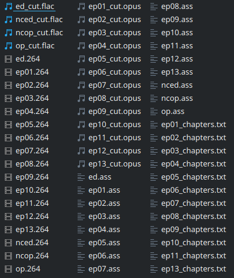
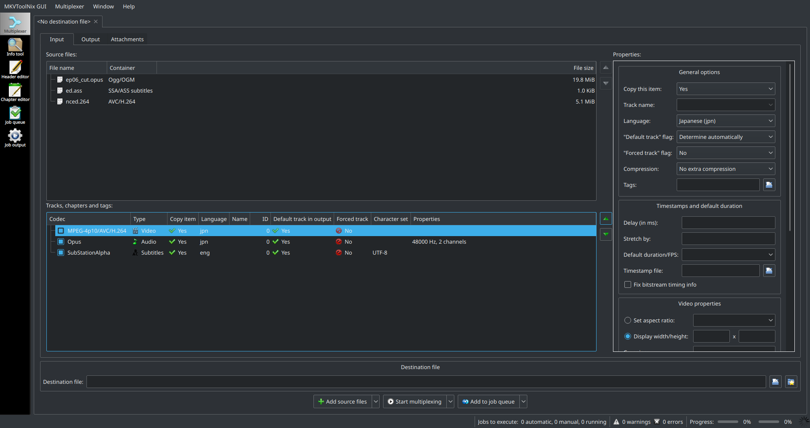
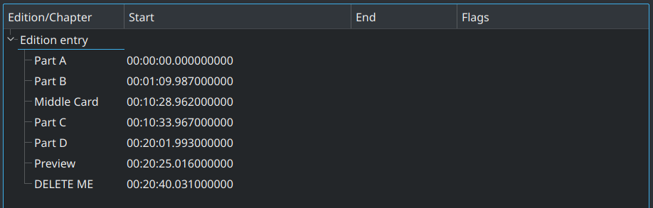
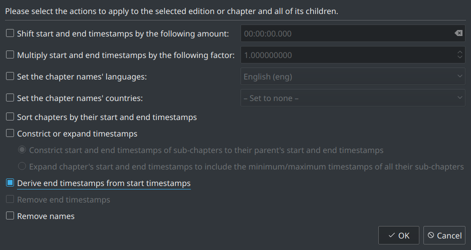
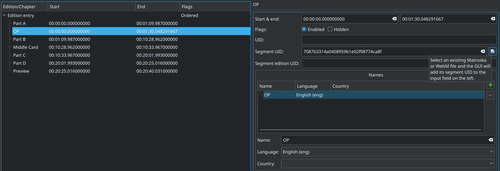
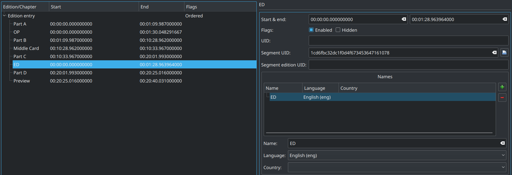
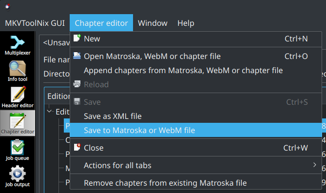

# Mastroka Container Tricks

*Disclaimer: this page assumes some basic knowledge of the Mastroka container,
Python, and VapourSynth.*


## Background and Preparation

The Mastroka Media Container is an open source,
open standard multimedia container
that is heavily used in the fansubbing scene.
Mastroka video, or `.mkv` files
are the standard for soft-subbed releases
as they allow for multiple subtitles tracks and chapters
which are a somewhat unique feature to the container.
The MPEG-4 Part 14 or MP4 is another container format
but it is limited in its usefulness for fansubbing.

Ordered-chapters are a special feature of mkv files that allows
the player to reference other mkv files in the same folder
to create a virtual combined timeline.


### Why use ordered-chapters over normal chapters?

The example use case we will be looking at starts with the ability
to cut out the OP/ED from each episode in a series 
(assuming the OP/ED stays consistent throughout the show).
This comes with at least four benefits that are unachievable
using normal chapters:

1. We avoid having to encode the same OP/ED sequence for each episode
   saving us encoding time.
    - This also means we only need to mux in OP/ED fonts and potentially large
      kfx subtitle files once instead of into each episode.
1. We can use different audio/video settings for the OP/EDs
   than for the main episodes.
    - Using FLAC for the music and a more compressible lossy codec
      for the main episode audio tracks will save space and satisfy audiophiles
      that want lossless music.
    - Using a much lower CRF value for the OP/ED will still likely save space
      as we are only encoding each once.
1. We can create a 'playall' file that creates a virtual timeline of
   all of the main episodes, skipping previews and
   only playing the OP/ED once over the entire timeline.
1. Using editions, we can allow the viewer to switch between the no-credit (NC)
   versions of the OP/ED and the normal ones.


### Necessary tools

The following steps will require
[VapourSynth][],
[MKVToolNix GUI + CLI][toolnix],
and [FFmpeg][] to be installed
(or readily available as binaries).
A [Mastroka-friendly player][mk-playback], preferably [MPC-HC][] or [mpv][],
will also be required for testing the files.

The examples will be using pre-made subtitle tracks,
a BDMV source,
[VSEdit](preparation.md#the-editor),
an [audio-cutting Python script][acsuite.py],
and some utility scripts/functions to help speed up the process.

What we will be doing:

1. Remuxing a BDMV into a Mastroka video file
1. Trimming out OP/EDs from our episodes
1. Encoding these trimmed clips
1. Trimming audio to match our encoded clips
1. Encoding episode audio and OP/ED audio with different codecs
1. Creating virtual timelines with ordered chapters
1. Using editions to change between NCOP and OP
1. Creating a playall file with ordered chapters

[VapourSynth]: https://github.com/vapoursynth/vapoursynth/releases
[toolnix]: https://mkvtoolnix.download/downloads.html
[FFmpeg]: https://ffmpeg.zeranoe.com/builds/
[mk-playback]: https://github.com/hubblec4/Matroska-Playback/blob/e48149b500ce80c38ebc07ccf8f74f8af45e89b2/src/PlayerOverview.md
[MPC-HC]: https://github.com/clsid2/mpc-hc/releases
[mpv]: https://mpv.io/installation/
[acsuite.py]: https://github.com/OrangeChannel/acsuite


### Preparing the work environment

#### Remuxing the BDMV

In the folder containing the folders titled `BDMV` and `CERTIFICATE`,
running the following command will remux the blu-ray into one large
mkv file.
We will be doing **all** encoding and trimming from this mkv.

```sh
ffmpeg -i bluray:BDMV/../ -map 0 -c copy -c:a pcm_s16le remuxed_volume1.mkv
```

#### Establishing a naming convention

The following steps should be done from within a folder containing
all the files needed to create an ordered-chapters release.
Having a standard naming convention will be helpful,
and in this example we will be using `##.ext` for all relevant files.

```
/ordered_chaps
    remuxed_volume1.mkv
    01.ass
    01.264
    01.wav
    01_cut.wav
    fonts01/
        example_font.ttf
        ...
    ...
```
<figcaption style="margin-top: -1em">Example directory structure.</figcaption>


### Trimming the episodes

With VapourSynth, we will cut out the OP/ED from our episode clips.
We will assign the OP and the ED their own clips
(simply the first time they appear)
that we will encode later.

```py
import vapoursynth as vs
core = vs.core
volume1 = core.ffms2.Source(r'remuxed_volume1.mkv')
ep01 = vol1[:30042]        + vol1[32201:34046]  # cut out OP from (30042, 32200)
ep02 = vol1[34070:35748]   + vol1[37907:65048]   + vol1[67181:68093]  # cut out OP (35748, 37906) and ED (65048, 67180)
ep03 = vol1[68117:70059]   + vol1[72218:98591]   + vol1[100726:102140]
ep04 = vol1[102164:104730] + vol1[106887:133140] + vol1[135273:136185]
op = vol1[30042:32201]
ed = vol1[65048:67181]
```

This page isn't meant to teach how to encode,
so there will be no filterchain for each episode.
We will be simply encoding these clips using x264 resulting in: 
`01.264`, `02.264`, `03.264`, `04.264`, `op.264`, `ed.264`.


## Finding our chapters

This is the most tedious part of this entire process,
as you will have to go through the volume's clip and note
frame-ranges for each chapter you want named **and the chapters you cut
out earlier**.

To start the automation process,
organize your frame ranges (in a Python file) into a dictionary
in the following format:

```py
chapters = {
    'ep|title': (BEGINNING FRAME, ENDING FRAME),
    ...
}
```

where both frames are inclusive (not like a normal Python slice).
Keep the titles for the ranges cut out consistent (called `OP` and `ED` here).
Make sure these frame ranges match
our VapourSynth slicing we did earlier
(i.e. `'01|OP'` was correctly sliced out of `ep01`).

```py
chapters = {
    '01|Part A':      (0, 3770),
    '01|Title Card':  (3771, 3860),
    '01|Part B':      (3861, 20883),
    '01|Middle Card': (20884, 21003),
    '01|Part C':      (21004, 30041),
    '01|OP':          (30042, 32200),
    '01|Part D':      (32201, 33685),
    '01|Preview':     (33686, 34045),

    '02|Part A':      (34070, 35747),
    '02|OP':          (35748, 37906),
    '02|Part B':      (37907, 51308),
    '02|Middle Card': (51309, 51428),
    '02|Part C':      (51429, 65047),
    '02|ED':          (65048, 67180),
    '02|Part D':      (67181, 67732),
    '02|Preview':     (67733, 68092),

    '03|Part A':      (68117, 70058),
    '03|OP':          (70059, 72217),
    '03|Part B':      (72218, 81784),
    '03|Middle Card': (81785, 81904),
    '03|Part C':      (81905, 98590),
    '03|ED':          (98591, 100725),
    '03|Part D':      (100726, 101779),
    '03|Preview':     (101780, 102139),

    '04|Part A':      (102164, 104729),
    '04|OP':          (104730, 106886),
    '04|Part B':      (106887, 120887),
    '04|Middle Card': (120888, 121007),
    '04|Part C':      (121008, 133139),
    '04|ED':          (133140, 135272),
    '04|Part D':      (135273, 135824),
    '04|Preview':     (135825, 136184)
}
```

Once this process is complete,
acsuite will do most of the remaining work for us. <!-- write those functions lol -->

## Trimming the audio + generating chapters

**Note:** *the frame numbers used in acsuite's `octrim`
and `eztrim`
are from the __untrimmed source clips__.
The exact syntax is explained in the docstrings for `acsuite.py`.*


### Non-chapter files (OP/ED)

For the OP/ED, NCOP/NCED we will use the frame ranges we found above
in the [VapourSynth script](#starting-with-trimming-the-video).
Since there are no chapters for these four clips, we will be using acsuite's
`eztrim`.

In order to save time, we will be using `acsuite.audio_trim`
as a wrapper for `eztrim` and FFmpeg's audio extraction.

*If the desired audio track is not the first,
add `track_no=#` to the `audio_trim` arguments.*

```py
import acsuite as ac

# op = bdmv01[30042:32201] --> eztrim takes these frames directly (30042, 32201)
# ed = bdmv02[30978:33111] --> (30978, 33111)
# nced = bdmvNCED[:2133] --> (0, 2133)
# ncop = bdmvNCOP[:2158] --> (0, 2158)

ac.audio_trim('ep01.m2ts', (30042, 32201), ez=True, name='op')
ac.audio_trim('ep02.m2ts', (30978, 33111), ez=True, name='ed')
ac.audio_trim('nced.m2ts', (0, 2133), ez=True)
ac.audio_trim('ncop.m2ts', (0, 2158), ez=True)
```

The above lines can be ran individually in a new Python instance
in your working directory.
After this is complete,
there will be 8 new files in your directory:

- `ed_cut.wav` *
- `ep01.wav` (delete)
- `ep02.wav` (delete)
- `nced_cut.wav` *
- `nced.wav` (delete)
- `ncop_cut.wav` *
- `ncop.wav` (delete)
- `op_cut.wav` *

Files marked with an asterisk * are our trimmed audio files.
The rest are artifacts from the FFmpeg extraction that can be deleted now.

In the author's example, episode 12 only contains one chapter
so we will also cut this with `eztrim`.

```py
ac.audio_trim('ep12.m2ts', (0, 34213), ez=True)
```

- `ep12_cut.wav` *
- `ep12.wav` (delete)

### Files with chapters

For our main episodes, the trimming process is more complex.
The `octrim` function was designed to automate this,
and the exact syntax and usage can be found in the docstrings.

To save time, we will be using the same `audio_trim` function
we used previously to avoid manually extracting audio tracks.

#### Finding our chapter frame ranges

For `octrim`, we will need the chapter frame ranges (inclusive)
and optionally their names. The frames here are from the **untrimmed source
clips (bdmv01, bdmv02, etc.)**.

Putting these into a Python script as lists of 3-tuples (start, end, name)
will help later when trimming the audio.

*Note: for `chaps01`, `'Part A'` starts on frame 0 and ends on frame 3770.
The ending number can be left off
(see: [acsuite syntax][acshelp])
if the chapters are continuous.
For `chaps01`, `'Part C'` starts on 21004 and ends on 30041
(notice we are going to slice the next segment out of the clip,
hence the `bdmv01[:30042]+bdmv01[32201:34046]`).
`'Part D'` starts on our next slice at frame 32201.*

```py
chaps01 = [(0, 'Part A'), (3771, 'Title Card'), (3861, 'Part B'), (20884, 'Middle Card'), (21004, 30041, 'Part C'), (32201, 'Part D'), (33686, 34045, 'Preview')]
chaps02 = [(0, 1677, 'Part A'), (3837, 'Part B'), (17239, 'Middle Card'), (17359, 30977, 'Part C'), (33111, 'Part D'), (33663, 34022, 'Preview')]
chaps03 = [(0, 1941, 'Part A'), (4101, 'Part B'), (13668, 'Middle Card'), (13788, 30473, 'Part C'), (32609, 'Part D'), (33663, 34022, 'Preview')]
chaps04 = [(0, 2565, 'Part A'), (4723, 'Part B'), (18724, 'Middle Card'), (18844, 30975, 'Part C'), (33109, 'Part D'), (33661, 34020, 'Preview')]
chaps05 = [(0, 839, 'Part A'), (2997, 'Part B'), (15058, 'Middle Card'), (15178, 31265, 'Part C'), (33399, 'Part D'), (33663, 34022, 'Preview')]
chaps06 = [(0, 1701, 'Part A'), (3861, 'Part B'), (16976, 'Middle Card'), (17096, 30256, 'Part C'), (32392, 'Part D'), (33662, 34021, 'Preview')]
chaps07 = [(0, 1102, 'Part A'), (3261, 'Part B'), (21698, 'Middle Card'), (21818, 31217, 'Part C'), (33351, 'Part D'), (33663, 34022, 'Preview')]
chaps08 = [(0, 3932, 'Part A'), (6090, 'Part B'), (16543, 'Middle Card'), (16664, 30448, 'Part C'), (32584, 'Part D'), (33662, 34021, 'Preview')]
chaps09 = [(0, 719, 'Part A'), (2878, 'Part B'), (11581, 'Preview'), (11701, 31000, 'Part C'), (33134, 'Part D'), (33662, 34021, 'Preview')]
chaps10 = [(0, 791, 'Part A'), (2949, 'Part B'), (16448, 'Middle Card'), (16568, 30160, 'Part C'), (32296, 'Part D'), (33662, 34021, 'Preview')]
chaps11 = [(0, 287, 'Part A'), (2446, 'Part B'), (18892, 'Middle Card'), (19012, 29081, 'Part C'), (31216, 'Part D'), (33661, 34020, 'Preview')]
# chaps12 = (0, 34212, 'Part A') --> already cut with eztrim
chaps13 = [(2158, 'Part 1 - "You Never Let Us Down"'), (16374, 'Middle Card I'), (16494, 'Part 2 - "Always Growing Closer"'), (17797, 'Middle Card II'), (17941, 'Part 3 - "Let\'s Change You Into This!"'), (27171, 'Middle Card III'), (27291, 30473, 'Part 4 - "I\'m Your Big Sister"')]
```

Once we have these lists,
we will call `audio_trim` with them and their respective files.

```py
import acsuite as ac
ac.audio_trim('ep01.m2ts', chaps01)
ac.audio_trim('ep02.m2ts', chaps02)
...
ac.audio_trim('ep11.m2ts', chaps11)
ac.audio_trim('ep13.m2ts', chaps13)
```

Running the above script with Python (may take a few minutes to complete)
will result in *many* new files in your working directory.

For the author's example, the resulting files and their sizes are:

- `ep1_cut.wav` -- `ep13_cut.wav` (total: 2.9 GiB)
- `(ed|op|nced|ncop)_cut.wav` (total: 65.6 MiB)

[acshelp]: https://github.com/OrangeChannel/acsuite/blob/a7e36aa65533a93bbaaa75b6fc5345194b27a5df/acsuite.py#L127


## Encoding the audio

We will be using FFmpeg's *libopus* and *flac* encoders.
The following examples simply loop[^2] the command for every `ep*.wav` file,
and all four op/ed files.

For the main episodes, we will be using opus:

```sh
$ fd -e wav --regex "(_cut)" -E 'op*' -E 'ed*' -E 'nc*' -x ffmpeg -i {} -c:a libopus -b:a 128k -cutoff 20000 {.}.opus
```

And for the OP/ED's, we will use FLAC:

```sh
$ fd -e wav -E 'ep*' -x ffmpeg -i {} -c:a flac -compression_level 12 {.}.flac
```

This results in the following files:

- `ep1_cut.opus` -- `ep13_cut.opus` (total: 259.7 MiB) 91.3% reduction
- `(ed|op|nced|ncop)_cut.flac` (total: 39.8 MiB) 39.3% reduction

Normally, using two different audio codecs within the same file
would not be possible.
However, ordered chapters make it possible for each file to use its own codec
(as long as the track order is the same).

*For the audiophiles who like to keep their anime music lossless,
we've encoded only the OP/EDs with FLAC.
This leaves the episode to be compressed more efficiently with a lossy codec
such as opus, for those who don't like 'wasting' space with lossless audio.
Since we are encoding around 90% <!-- TODO: recalculate --> of the show with opus,
and only have the OP/ED + NCOP/NCED files occurring once,
the filesize difference and lossless music should satisfy both groups.
Normal dialogue should be nearly transparent at 128 kbps with opus,
but this comes with some caveats.
If there are 'insert' songs within an episode that you'd like to keep lossless,
you will need to encode the entire episode with a lossless codec.*


## Working with ordered chapters

*At this point, you should have encoded clips of each episode
plus the OP/ED/NCOP/NCED encodes.
The following assumes these clips are named in the same `ep##.264` format
as the .m2ts files.
In our working directory, we should also have subtitle tracks, `ep##.ass`,
and the encoded audio tracks `ep##_cut.opus`.
If you used the above audio-cutting commands,
chapter files in plaintext should also be in the folder.*

At this point, you can delete the .wav files and move the .m2ts files
out into their own folder.
Your working directory should now look like this:




### Muxing

Before we can start using ordered chapters,
we will have to mux the current files into mkv's.
This is because ordered chapters reference other mkv's by their UID
to generate the virtual timeline for the player.
MKVToolNix can save chapters *into* existing mkv files,
so this step will be the **only time** we mux.

This can be done with the MKVToolNix GUI,
in which case the order of the tracks in the bottom list is important.
Although mpv will only warn that tracks are mismatched,
it is a good idea to keep the same track order in all of the mkv's.
In our example, we will use
*Video*, *Audio*, then *Subtitles*
as the order for every file.

The order can be changed with the arrows or by dragging the tracks
in the bottom box of the *Mulitplexer* window in the GUI:



This can also be done automatically using the command line.
An example Python script (with no attachments):

```py
import shlex, subprocess

video_eps = ['ep{:02d}'.format(i) for i in range(1, 14)]
video_op = ['ed', 'nced', 'ncop', 'op']
videos = video_eps + video_op

audio_eps = ['ep{:02d}_cut.opus'.format(i) for i in range(1, 14)]
audio_op = ['ed_cut.flac', 'nced_cut.flac', 'ncop_cut.flac', 'op_cut.flac']
audios = audio_eps + audio_op

for n, a in zip(videos, audios):
    args = shlex.split('mkvmerge -o {0}.mkv {0}.264 {1} {0}.ass'.format(n, a))
    subprocess.run(args)
```

Since this is the only time we will actually be muxing,
all attachments should be added here as needed with their subtitle tracks
(if a font is used in `op.ass`, only add it to the `op.mkv` file).
Adding a title and setting track languages
should also be done at this point.

<!-- TODO: Verify this behavior works on non-mpv players -->
<!-- TODO: Mention issue with corrupted or missing subtitle tracks:
    basically what happens in mpv is that it will show all tracks from
    across all referenced segments causing subtitles from the external
    segment to become track #2 and not appear without manual switching
    I've noted this happening with mal-formatted .ass, empty subtitle files,
    and somewhat when tracks are missing or mis-aligned but this missing thing
    specifically needs more testing
-->


### Typical Episode

The first episode in the example that contains both the OP and the ED
is episode 2, so we will start there.

In our directory, there should be plaintext chapter files
generated by `octrim`.
Using the MKVToolNix-GUI's *Chapter Editor* mode,
we will open this file.
(This can also be done from the command-line: `mkvtoolnix-gui --edit-chapters "ep02_chapters.txt"`.)

In the example above,
the *Chapter editor* GUI should at first look like this:



Ordered chapters require a start *and* an end timestamp,
so we will need to generate the *End* column here.
This can be accomplished by right-clicking the *Edition entry*,
and selecting *Additional modifications*.
Make sure only *Derive end timestamps from start timestamps* is ticked.



After deriving the end timestamps,
delete the last chapter,
as it was a placeholder generated by `octrim`
to determine the end timestamp of the last chapter.

On the *Edition entry*, we can now tick *Ordered*:


At this point, if we were to mux these chapters into our episode 2 file,
they will act like normal chapters,
and the episode will play without the OP and ED.


### Adding in our OP

Before we add in the OP,
we need to determine the timestamps needed for the timeline
to reference our `op.mkv`.

If we had chapters generated for the OP,
we could simply copy over those timestamps
(we will do this with our *playall* file later).
Instead, we will simply use the number of frames in the entire op
to determine the end timestamp.

From our trim, `op = bdmv[30042:32201]`,
we find that the clip is $$32201-30042=2159$$ frames long.
This can also be found from `op.num_frames` in VapourSynth.

Using a small [script to change frame numbers into timestamps][f2ts.py],
we find that 2159 frames translates to `00:01:30.048291667`.
This can also be accomplished with this following line in a Python instance.

```py
for _ in input().split():print('%02d:%02d:%09f'%((m:=(s:=int(_)/23.976)//60)//60,m%60,s%60))
```

We will add a chapter titled *OP* between *Part A* and *Part B*,
where it was originally in the uncut video.


The timestamp above becomes this chapter's end timestamp.

Now, in order for the player to know what file this chapter comes from,
click the folder icon next to *Segment UID:* and open the `op.mkv` file.
This will automatically find the UID of the mkv
and input it for this chapter's SUID:



Players will only search within the current directory for referenced files,
so `op.mkv` must be kept in the same folder as our episode 2
if we want it appearing in the timeline.

Example mpv output:

```
File uses ordered chapters, will build edit timeline.
This file references data from other sources.
Will scan other files in the same directory to find referenced sources.
Match for source 1: ./op.mkv
Timeline segments have mismatching codec.
```

*Although mpv shows this mismatching codec warning,
playback is not affected.*

By adding this chapter,
any compatible player will add frames 0-2158 from the `op.mkv`
into the timeline of `ep1.mkv` when episode 2 is played.
The `op.mkv` file will remain unaffected,
meaning it can be played separately on its own.

[f2ts.py]: https://gist.githubusercontent.com/OrangeChannel/330a032e4d6cf9265b8b007c41112937/raw/frame-to-timestamp.py


#### Adding in our ED

Adding the ED between *Part C* and *Part D* follows the same process.



Once we are satisfied with our virtual chapter timeline,
save the chapters to the episode 2 mkv.



---

<!-- TODO: re-word footnote 1 -->
[^1]: If you are extracting audio from a .m2ts, you might want to check what audio codec is being used internally. In this example, `ffprobe` revealed that the blu-ray was using the standard `pcm_bluray` at 16-bits, but your file may be 32-bit or using the DTS-HD MA standard. If you are dealing with non-BDMV files, you can also use ffmpeg to extract the audio, but it should be re-encoded losslessly into PCM (can be achieved automatically by setting the file extension of ffmpeg's output file to `.wav`).

[^2]: the `fd` utility can be installed from its [GitHub repo][fd].

[fd]: https://github.com/sharkdp/fd/releases
