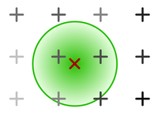
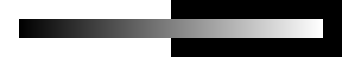
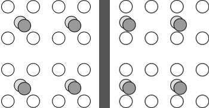
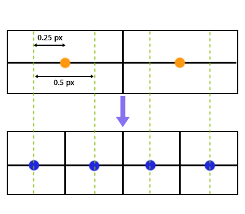

# Resampling

Resampling is a technique applied in various
image processing tasks,
most prominently scaling/resizing,
but also shifting and rotation.


## Resizing

The most common class of resampling algorithms
used for resizing are the convolution-based resamplers.
As the name suggests,
these work by [convolving][Convolution] the image
with a filter function.
These filter functions,
also known as kernels,
are what the terms Bilinear/Bicubic/Lanczos/etc. generally refer to.
The [ImageWorsener documentation][ImageWorsener] features a great
visual explanation of how this process works in detail.
It is strongly recommended to read it.
If you wish to explore the mathematics behind the design
of these filters,
the [Sampling and Reconstruction chapter][Sampling chapter]
of [Physically Based Rendering][PBRT] is one of the best places
for a layman to start.

[Convolution]: https://en.wikipedia.org/wiki/Convolution
[Sampling chapter]: https://www.pbrt.org/chapters/pbrt_chapter7.pdf
[PBRT]: https://www.pbrt.org/
[ImageWorsener]: https://entropymine.com/imageworsener/resample/


### Filters

All resampling kernels behave slightly differently
and generate artifacts of differing kinds and severity.

It should be noted that there is no “objectively best” resampling filter,
so it is largely a matter of personal preference.
There are no hard and fast rules about
which resampler performs best for any given type of content,
so it’s best to test them yourself.

A short overview of the most common filters follows.
For a much more extensive explanation of the different filters,
including details on the exact algorithms,
see [ImageMagick’s guide][IM].

Additionally,
[ResampleHQ][RHQ]'s documentation features
an excellent visual comparison of common filter kernels;
a back-up is available [here][kernels].

[IM]: http://www.imagemagick.org/Usage/filter/
[RHQ]: https://forum.doom9.org/showthread.php?t=160038
[kernels]: http://maven.whatbox.ca:11665/resample_kernels/kernels.html


#### Box filter / Nearest Neighbour

When upscaling,
the Box filter will behave just like
[Nearest Neighbour (*NN*) interpolation][NN],
that is,
it will just pick the closest pixel in the input image
for every output pixel.
This results in the source pixel grid being magnified
without any smoothing or merging of adjacent pixels,
providing a faithful representation of the original pixel grid.
This is very useful when inspecting an image up close
to examine the pixel structure,
or when enlarging [pixel art][],
but not suitable for regular content
due to the jagged lines and deformed details it causes.

When downscaling,
the Box filter behaves differently to
NN—which continues to just
pick the closest pixel and
be done with it—in that it instead
merges adjacent pixels together.
(This is because generally,
filter kernels are widened
in proportion to the scaling factor
when downscaling,
which, in effect, applies a [low-pass filter][]
that serves to prevent aliasing.)
Unlike most other filters, however,
it averages them evenly
instead of giving the central ones more weight.
(For example, reducing a 10 pixel row to 5 pixels
will average every pixel pair.)
This, again,
can be a useful property in specific cases,
but is not generally desirable.

The Box filter is available in VapourSynth
in the ``fmtconv`` plug-in:

```py
clip = core.fmtc.resample(src, w, h, kernel="box")
```

Nearest Neighbour interpolation is part of the built-in ``resize`` plug-in:

```py
clip = core.resize.Point(src, w, h)
```

Most [script editors](preparation.md#the-editor) including VSEdit feature NN scaling in the preview;
it is recommended to use it over Bilinear
when making filtering decisions.

[NN]: https://en.wikipedia.org/wiki/Nearest-neighbor_interpolation
[pixel art]: https://en.wikipedia.org/wiki/Pixel_art
[low-pass filter]: https://en.wikipedia.org/wiki/Low-pass_filter

#### Bilinear / Triangle

Bilinear, also known as Triangle due to its graph’s shape,
is one of the most common algorithms in widespread use
because of its simplicity and speed.
However,
it generally creates all sorts of nasty artifacts
and is inferior in quality to most other filters.
The only advantage it offers is speed,
so don’t use it unless you’re sure you have to.

VapourSynth example:

```py
clip = core.resize.Bilinear(src, w, h)
```


#### Mitchell-Netravali / Bicubic

The Mitchell-Netravali filter,
also known as Bicubic,
is one of the most popular resampling algorithms,
and the default for many image processing programs,
because it is usually considered a good neutral default.

It takes two parameters, B and C,
which can be used to tweak the filter’s behaviour.
For upscaling, it is recommended to use values that satisfy the equation
$$\mathrm{b} + 2\mathrm{c} = 1$$.

The graph below outlines
the various kinds of artifacts
different B-C-configurations produce.


Roughly speaking,
raising B will cause blurring
and raising C will cause ringing.

Mitchell-Netravali generalizes all smoothly fitting
(continuous first derivative) piece-wise cubic filters,
so any of them can be expressed with the appropriate parameters.
Below you can find a list of common cubic filters
and their corresponding parameters in Mitchell-Netravali.

- B-Spline – b=1, c=0
- Hermite – b=0, c=0
- Mitchell-Netravali – b=1/3, c=1/3 (sometimes referred to as just “Mitchell”)
- Catmull-Rom – b=0, c=0.5
- Sharp Bicubic – b=0, c=1

Hermite is often considered one of the best choices for downscaling,
as it produces only minimal artifacting,
at the cost of slight blurriness.

VapourSynth example:

```py
# 'filter_param_a' and 'filter_param_b' refer to B and C, respectively
clip = core.resize.Bicubic(src, w, h, filter_param_a=0, filter_param_b=0.5)
```


#### Lanczos

Lanczos is generally considered
a very high-quality resampler for upscaling,
especially its [EWA version](#elliptical-weighted-averaging-ewa-cylindrical-polar-circular).

It is usually slightly sharper than Mitchell (Bicubic b=c=1/3),
but might produce slightly more ringing.

Lanczos takes an additional parameter
that controls the filter’s number of lobes,
or *taps*.
Increasing the number of lobes
improves sharpness at the cost of increased ringing.
You might occasionally see the tap count
appended to the filter name to clarify
the exact filter used, e.g. Lanczos2 for 2 taps.

For downscaling,
higher tap counts might help in
suppressing [Moiré effects][Moire].


```py
# 'filter_param_a' specifies the tap count
clip = core.resize.Lanczos(src, w, h, filter_param_a=2)
```

[Moire]: http://www.imagemagick.org/Usage/filter/#aliasing


#### Spline

Spline is another high-quality resizer.

Spline, like Lanczos,
can be fine-tuned by configuring its number of lobes.
Unlike Lanczos,
however,
Splines with different tap counts are usually split
into separate functions,
with $$(\mathrm{tap~count} \times 2)^2$$ appended to their name,
e.g. Spline36 for 3 taps, Spline64 for 4, etc.
(This number represents the total amount of input pixels
involved in the calculation of any given output pixel.)

Spline36 is a very popular choice for downscaling,
since it is fairly artifact-free yet decently sharp.
For upscaling,
it looks similar to Lanczos3,
though arguably slightly less artifacted.

VS example:

```py
clip = core.resize.Spline36(src, w, h)
```

Higher tap counts can be used via fmtconv:

```py
clip = core.fmtc.resample(src, w, h, kernel="spline", taps=6) # equivalent to Spline144
```


#### Gauss

The Gaussian filter is very special in that its Fourier transform[^1]
is another Gaussian
whose width is inversely proportional to the spatial function’s.
This can be harnessed to remove and amplify high frequencies
in a very controllable way.
Widening the filter,
for example,
will confine the output to small frequencies (blurrier),
whereas squashing it will amplify higher frequencies (more aliasing).

In practice,
though,
the Gaussian filter isn’t all too useful for regular resizing.
However,
it can be used to accurately emulate a Gaussian blur
(when used without resizing)
in VapourSynth.

For example:

```py
blurred = core.fmtc.resample(src, kernel="gauss", fh=-1, fv=-1, a1=1)
```

``fh=-1, fv=-1`` forces the processing
when no resizing is performed.
``a1`` controls the blurring:
the higher,
the sharper the image.


### Interpolation filters

Some sources will categorize filters as either
interpolation filters or non-interpolation filters.

Interpolation filters are those that
when applied “in-place”,
i.e. at the location of the input samples,
don’t alter the sample value.
Therefore,
they only interpolate “missing” values,
leaving the input samples untouched.

This is true for filters that evaluate to 0
at all integer positions except 0
or whose support is <= 1.
Examples include:
(Windowed) Sinc filters,
such as Lanczos,
Bicubic with B=0,
e.g. Hermite and Catmull-Rom,
and Triangle/Bilinear.

This can be a beneficial property in some cases,
for example the No-Op case.
No-Op means that no scaling, shifting or similar is performed,
that is, the input is resampled at exactly the same positions.
In this case,
an interpolation filter will return the input image untouched,
whereas other filters will slightly alter it.

Another,
more practical,
case where this property is useful
is when shifting an image by full pixel widths (integers),
again because input pixel values aren’t changed
but just relocated.


### Two-dimensional resampling

There are two different ways to go about
resampling in two dimensions.


#### Tensor resampling (*orthogonal*, *2-pass*, *separated*)

The image is resampled in two separate passes:
First it is resampled horizontally, then vertically.
This allows images to be treated 1-dimensionally
since each pixel row/column can be resampled separately.
The main advantage of this method is that it's extremely fast,
which is why it’s the much more common one;
generally, unless indicated otherwise,
this is what is used.


#### Elliptical Weighted Averaging (*"EWA"*, *cylindrical*, *polar*, *circular*)



All input samples whose [Euclidean distance][L2] to the pixel
is within the filter’s radius contribute to its value.
The Euclidean distance is passed to the filter kernel.
This is a lot more costly than tensor resampling in terms of runtime.

[L2]: https://en.wikipedia.org/wiki/Euclidean_distance


### Scaling in modified colorspaces

The colorspace used when resampling
can significantly impact the output’s subjective quality.


#### Downscaling in linear light

Downscaling in gamma-corrected light instead of linear light
can sometimes noticeably dim the image.
To see why this happens,
consider this gradient:



It should be apparent
that the brightness doesn’t scale linearly with the pixel values.
This is because most digital video
uses [gamma-transformed][gamma] pixel values
in order to compress more perceptually distinct color shades
into 8 bit.
This causes the encoded pixel values
to deviate from their expected brightness,
e.g. a grey pixel has value 187 instead of 127 in sRGB.
This poses a problem when merging and interpolating colors,
because the average pixel value of two colors no longer corresponds
to their average perceived brightness.
For example,
if you wanted to merge black and white (0 and 255),
you would expect to get grey,
but since grey actually has a value of ~187,
the output pixel would turn out substantially darker,
if you were you to naively average the pixel values.

To calculate the correct values,
the gamma transform needs to be reversed before scaling
and re-applied afterwards.

The dimming effect of scaling in gamma-corrected light
is usually only noticeable
in dense color patterns,
e.g. small black text on a white background,
stars in the night sky, etc,
and much less so in blurrier areas.

See [this comparison][comp] for a particularly extreme example
of linear vs gamma downscaling.

However,
this doesn’t necessarily mean downscaling in linear light
is always the right choice,
since it noticeably accentuates dark halos
introduced by scaling.
Thus,
it may be wise to scale in gamma light
when using a resizer prone to overshooting,
like high-lobe Lanczos.
Besides,
the dimming may even be desirable in some cases like black text on white paper,
because it preserves legibility.

If you choose to downscale in linear light,
make sure to use a sufficiently high bitdepth
so as to not introduce banding.

Example code for resizing in linear RGB light:

```py
linear = core.resize.Bicubic(src, format=vs.RGBS, transfer_in_s="709", transfer_s="linear", matrix_in_s="709")
scaled_linear = core.resize.Bicubic(linear, 640, 360)
scaled_gamma = core.resize.Bicubic(scaled_linear, format=src.format, transfer_s="709", transfer_in_s="linear", matrix_s="709")
```

Note that the ``matrix_s`` and ``matrix_in_s`` arguments
are only necessary when ``src`` is YUV;
otherwise, they should be omitted.

[gamma]: https://en.wikipedia.org/wiki/Gamma_correction
[comp]: https://slowpics.org/comparison/8103b2d1-b9d4-4d7e-b7a7-3197ae999244


#### Upscaling in sigmoidized light

In order to attenuate both dark and white halos
introduced by upscaling,
you can resize through a sigmoidized colorspace.

This means converting the linear RGB version of an image
to a custom colorspace with an S-shaped intensity curve
before scaling and converting it back afterwards.
What this does, essentially,
is decrease the image’s contrast
by pushing extreme values of both dark and bright
towards the middle.

Quoting Nicholas Robidoux from ImageMagick:

> You may decrease halos and increase perceptual sharpness by increasing the sigmoidal contrast (up to 11.5, say).

> Higher contrasts are especially recommended with greyscale images (even "false RGB greyscale" that have three proportional color channels).

> The downside of sigmoidization is that it sometimes produces "color bleed" artefacts that look a bit like cheap flexographic ("gummidruck") printing or chromatic aberration.

> In addition, sigmoidization's "fattening" of extreme light and dark values may not work for your image content.

> If such artefacts are obvious, push the contrast value down from 7.5 (to 5, for example, or even lower).

> Setting the contrast to 0 is equivalent to enlarging through linear RGB.

(Robidoux, 2012)[^2]

Example code for VS:

```py
import havsfunc as hf
linear = core.resize.Bicubic(src, format=vs.RGBS, transfer_in_s="709", transfer_s="linear", matrix_in_s="709")
sigmoidized = hf.SigmoidInverse(linear, thr=0.5, cont=6.5) # 'cont' corresponds to the “sigmoidal contrast” mentioned above
scaled_sigmoid = core.resize.Bicubic(sigmoidized, 640, 360)
de_sigmoidized = hf.SigmoidDirect(scaled_sigmoid, thr=0.5, cont=6.5)
scaled_gamma = core.resize.Bicubic(de_sigmoidized, format=src.format, transfer_s="709", transfer_in_s="linear", matrix_s="709")
```


### Neural network scalers

NN-based scalers have become
increasingly popular in recent times.
This is because
they aren’t subject to the technical limitations
of convolution-based resamplers—which beyond a certain point
only trade one artifact for another—and thus produce
much higher quality upscales.


##### NNEDI3

This is the current de-facto standard
for high-quality upscaling
because it generally produces equally as sharp or sharper
images than conventional scalers,
while avoiding any major artifacting
such as haloing, ringing or aliasing.

Nnedi3 was originally conceived as a deinterlacer;
as such,
it only doubles a frame’s height,
leaving the original pixel rows untouched
and interpolating the missing ones.
This, however, can trivially be leveraged
to increase image dimensions by powers of two
(by doubling *n* times,
flipping the image,
doubling *n* times again,
and flipping back).

Upsampling to arbitrary dimensions can be achieved
by scaling by the smallest power of two
that results in a bigger image than desired,
and downscaling to the requested resolution
with a conventional scaler
(the most popular choice for this is [Spline36](#spline)).

However,
you should note that
good quality comes at a cost:
nnedi3 will generally be several orders of magnitude
slower than conventional resamplers.

VapourSynth usage example:

```py
from nnedi3_rpow2 import *
# 'spline36' here is technically redundant since it’s the default
up = nnedi3_rpow2(src, width=1920, height=1080, kernel="spline36")

```


## Shifting

Shifting an image by an arbitrary amount,
including non-integer values,
requires resampling as well.
For example,
left-shifting by a quarter pixel
will resample the image at the input samples’ positions minus 0.25.[^3]
This also means that,
unless a [interpolative filter](#interpolation-filters) is used,
even shifting by integer amounts will alter the image.

Side note:
It can be interesting to think of shifting
not as resampling at shifted pixel locations,
but as resampling at the input locations
with a shifted kernel.


### Chroma shifting

When going from 4:2:0 [subsampling][]
to 4:4:4 (no subsampling),
it is important to take into account chroma placement
and to shift the chroma accordingly
to ensure it aligns with the luma.



There are two commonly used
chroma siting patterns,
as illustrated by the graphic above.
Most digital video today
uses the MPEG-2 variant,
that is,
left-aligned chroma.
This is essential to keep in mind
when going from 4:2:0 to 4:4:4,
because if the chroma planes
are naively upscaled and joined with the luma plane without any shifting,
the chroma will be shifted by a quarter pixel.
This is a consequence of the way
output pixels are usually mapped onto the input grid
during resampling:



Essentially,
the output grid is scaled
such that the outer edges of the pixel boxes align,
importantly under the assumption that samples are center-aligned
within the pixel boxes.
Therefore,
when scaling a chroma plane by 200%,
which is what happens to the chroma
when going from 4:2:0 to 4:4:4,
the new chroma sample positions will
match up with the luma sample positions.
This would be the correct mapping
if the resamplers’s assumption of center-alignment was true—if it isn’t
(like with MPEG-2 chroma placement)
we have to compensate for the offset by shifting the input samples
by a quarter pixel width to the left
before calculating the output samples.
This way,
the left-alignment is restored.

Similarly,
when resizing left-aligned 4:2:0 material
while keeping the subsampling,
a slight shift needs to be applied
to preserve the alignment.
Specifically,
the chroma needs to be shifted by
$$0.25 - 0.25 \times \frac{\mathrm{src~width}}{\mathrm{dst~width}}$$.[^4]

Chroma shifting is performed
automatically under the hood by most format conversion software
(including zimg, VapourSynth’s resizing library)
and media players.
Thus, we only need to take care of it
if we handle the chroma upscaling separately by hand.

In VS,
shifting can be performed with the ``resize`` functions’ ``src_left`` parameter:

```py
u = core.std.ShufflePlanes(src, planes=1, colorfamily=vs.GRAY)
shifted_scaled_u = core.resize.Spline16(u, 1920, 1080, src_left=0.25) # shifts the image to the left by 0.25 pixels
```

[subsampling]: https://en.wikipedia.org/wiki/Chroma_subsampling

---

[^1]: The Fourier transform is an ubiquitous concept in image processing, so we strongly advise becoming familiar with at least the basics. A very good resource for this topic is [ImageMagick’s guide][].
[^2]: Robidoux, N. (2012, October 21). Resampling — ImageMagick v6 Examples. Retrieved August 22, 2019, from https://www.imagemagick.org/Usage/filter/nicolas/#upsampling
[^3]: If you don’t understand what this means, read the resources linked above in the [resizing section](#resizing).
[^4]: This is derived as follows: The shift is the distance between the position of the first luma sample and the position of the first chroma sample (both mapped onto the input grid and given in terms of input chroma pixel widths). The former is located at $$0.25 + \frac{\mathrm{src~width}}{4 \times \mathrm{dst~width}}$$, the latter at $$\frac{\mathrm{src~width}}{2 \times \mathrm{dst~width}}$$. This yields $$0.25 + \frac{\mathrm{src~width}}{4 \times \mathrm{dst~width}} - \frac{\mathrm{src~width}}{2 \times \mathrm{dst~width}} = 0.25 + \frac{\mathrm{src~width}}{\mathrm{dst~width}} \times \left( ^1/_4 -\,^1/_2 \right) = 0.25 + \frac{\mathrm{src~width}}{\mathrm{dst~width}} \times (-0.25)$$ for the shift.

[ImageMagick’s guide]: http://www.fmwconcepts.com/imagemagick/fourier_transforms/fourier.html
