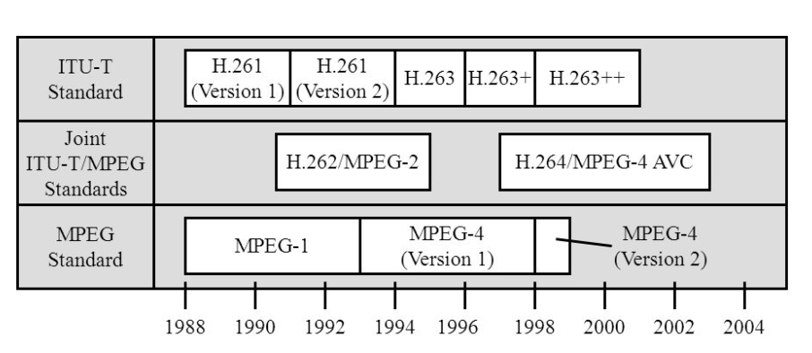
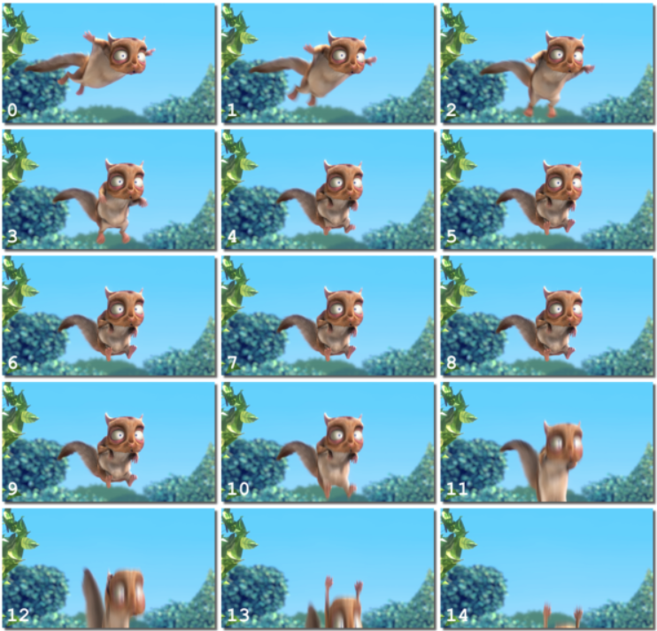

# Video Encoding

It's a long history while we talking about video codecs.

Nowadays, while h.264 is no doubt
the most popular video coding format
all over the world,
you can still find mpeg2
in some DVD video sources.
With the help of these video codecs,
we can easily compress
a big raw video into a tiny one.

What's more,
we should distinguish video codec from
the video coding format.
Although video coding formats
such as H.264/HEVC are sometimes
referred to as codecs,
there is a clear conceptual difference
between a specification
and its implementations.
Video coding formats are
defined in specifications,
while video codecs are
the software that implements
these specifications.
For example,
the video codec X264 is
the implementation of
the video coding format H.264.

In the next chapter,
we'll talk about some methods
during the compression
and the parameters that
control these processes.

## X264

**
Please trying to not explain this in complex way.
**
<TODO - Motion estimation(--me,--subme,--me-range)>
<TODO - Intra prediction>
<TODO - Definition of I,P,B Frame(--keyint,--min-keyint,--bframes,--b-adapt,--scenecut)>
<TODO - Multiple Reference Frame(--ref)>
<TODO - DCT Transform>
<TODO - Quantization coding(I do not know what it exactly called)(--crf,--qp,2pass)>
<TODO - Video Buffering Verifier(VBV)(--vbv-bufsize,--vbv-maxrate)>
<TODO - Macroblock Tree(--no-mbtree,--qcomp,--rc-lookahead,--qpmin,--qpmax)>
<TODO - Adaptive Quantizers(--aq-mode,--aq-strength,--trellis,--chroma-qp-offset)>
<TODO - Deblock(--deblock)>
<TODO - (not in H264, it is a encoder-side optimizations)Psychological optimization(I do not know what it exactly called)(--psy-rd)>

### Motion Estimation

Almost every video we process today
has much redundant information.
This is to say,
for many frames of a video,
the only difference between one frame
and another is the result of either
the camera moving or an object
in the frame moving.
This indicates that much of the
information renders one frame will be
the same as the used in the following frame.
So we don't need to keep all the
information in each frame.
Instead, we can store a frame
carries full information, 
and the subsequent frames can
only save the different part. 

H264 defines three ways 

Here's some commonly used options in X264 that affect the motion estimation stage while encoding:

`--me <str>` decides which algorithm X264 will use in motion estimation
- diamond: `--me dia` is the simplest search,
consisting of starting at the best predictor,
checking the motion vectors at one pixel
upwards, left, down, and to the right,
picking the best, and repeating the process
until it no longer finds any better motion vector.
It's a very fast but bad choice,
I'll only recommend this if
your computer is less powerful.

- hex: `--me hex` consists of a similar strategy,
except it uses a range-2 search
of 6 surrounding points,
thus the name.
It's a bit slower than diamond
but still not an ideal choice,
both hex and dia should only
be used if you are live-streaming.

- multiple hexagon: `--me umh` **Recommended!**
UMH searches a complex multi-hexagon pattern
in order to avoid missing
harder-to-find motion vectors.
This can bring some pretty decent result
while still having pretty fast speed,
choose this if you have
limited computing power
or the time is important for you.

- exhaustive: `--me esa` is mathematically equivalent
to the bruteforce method of searching
every single motion vector in the area. 
It's slower than "umh" and
the result isnot as good as "tesa".
I'll consider this as a
moderate choice but not recommended.

- SATD exhaustive: `--me tesa` **Recommended!**
It's an algorithm which attempts to
approximate the effect of running
a Hadamard transform comparison
at each motion vector;
like exhaustive, but a little bit better
and a little bit slower.
If you want the best result,
this is for you.

`--subme <int 0-10>` set the subpixel estimation complexity.
Higher numbers are better.
The recommend value of this parameter is 10.
If you want to get a bit faster, 8 is a good choice.

`--me-range <int default:16>` decides the max range
of the motion search in pixels. 
Higher numbers are better but slower.
It's recommended to set 24 for 720p content
and 36 for 1080p content.

`--no-fast-pskip` Disables early skip detection on P-frames.
Very slightly increases quality at some speed cost.
It depends on you to use it or not.

