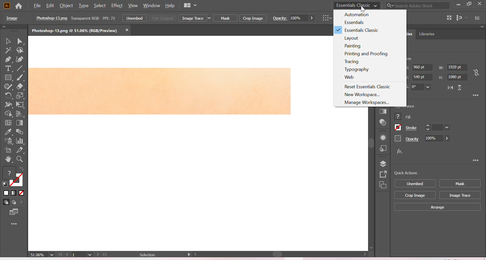
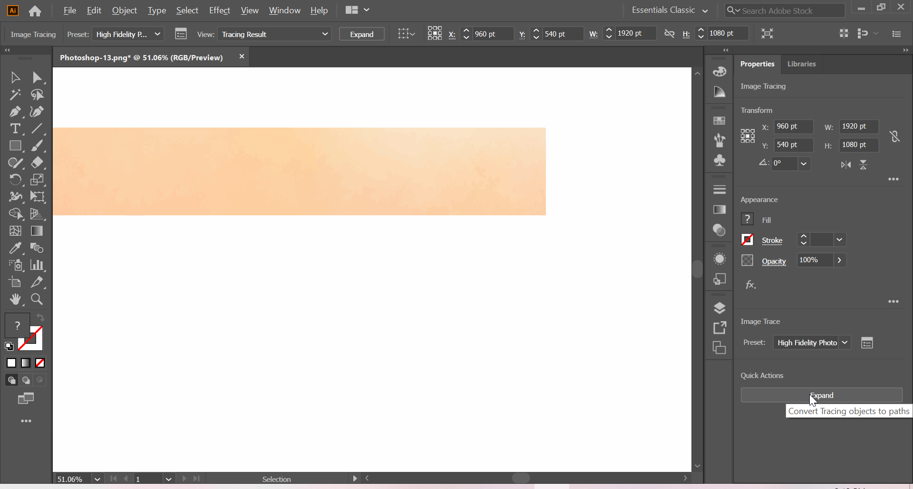
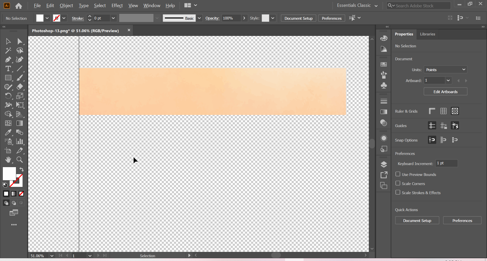
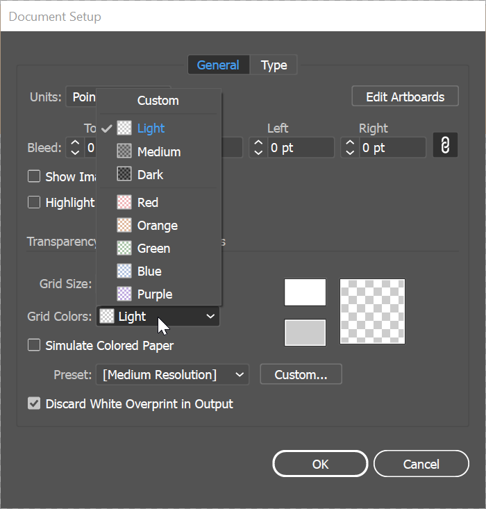
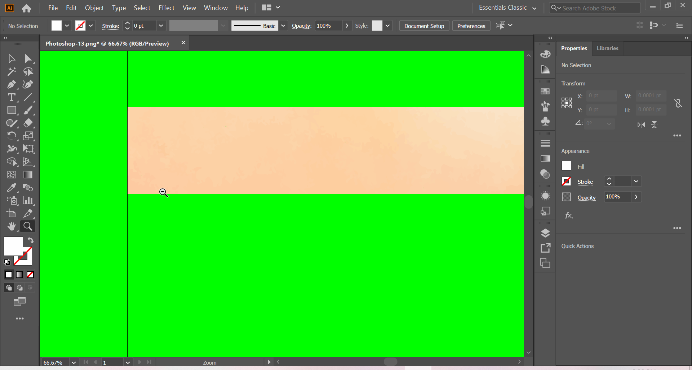
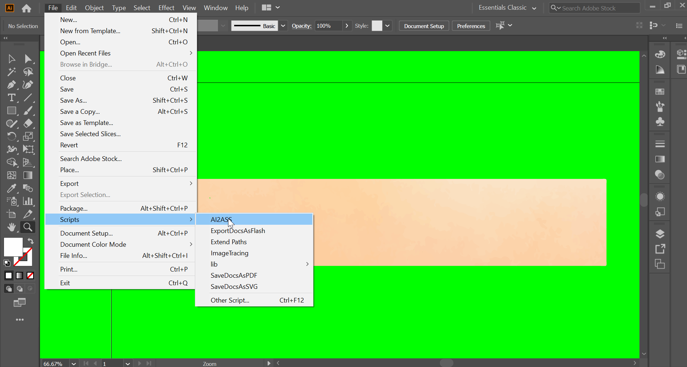
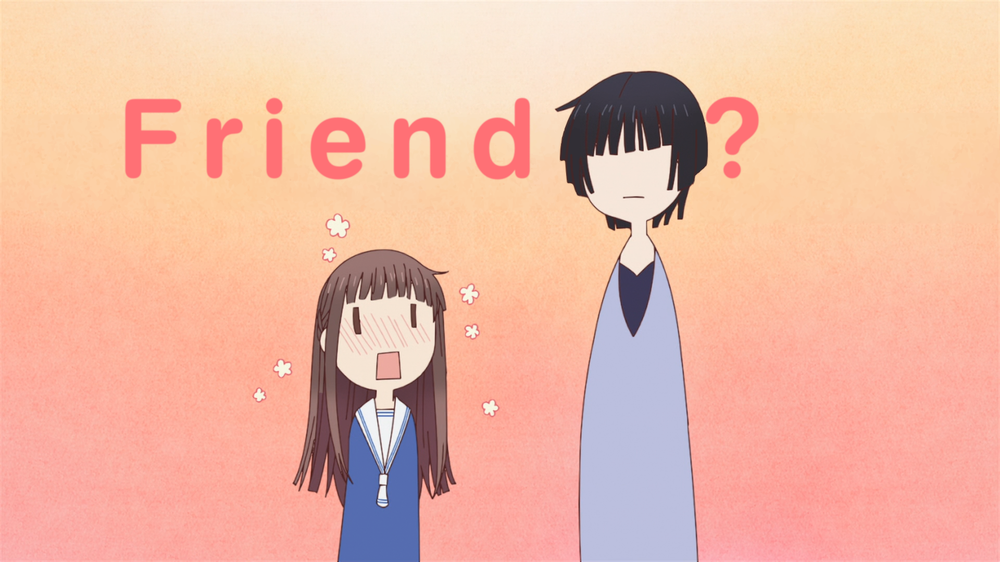

# Masking using AI and PS
## Procedure

I assume you have installed the [AI2ASS][]. 
If not do it. 

Drag and drop the final mask image which 
you have created in PS into the AI. 
Make sure you have selected **Essentials Classic**
as work space.

*Work space*

Now click on *Image Trace* which is present
in bottom of the right panel. 
After selecting you will see number of options 
in which select **High Fidilety Photo**.[^1] 
There is some pre-processing that needs to be done. 
Wait for it to get completed. 
After that you should see a window like below. 
Now click on *Expand* in bottom of right panel. 

*Expand*

After Expansion you should see blue lines 
on image like below image. 
Now click on *Ungroup* in bottom of right panel. 

*Ungroup*

Deselect the whole thing by clicking anywhere outside 
the canvas and press *Ctrl+Shift+d*.[^2] 
After that click on white background and press *Delete*. 
If you didn't messed up you should see a clean image.

*Clean AI image*

Sometimes ImageTrace can create 
**white spots around the edges**, 
so it is better to do a sanity check to make sure 
that there are no white spots around the edges. 
Click on *Document Setup* in bottom right. 
In the pop up window select *Grid Colors* option to *Custom*
and chose a color which is in contrast with the image.
I generally use green but use whatever color
is convienent for you.
And click ok.

*Grid colours*

Press *z* to *Zoom* and press *v* to select the *Selection tool*
and click on any white spots and press *Delete* to delete them.
This is how you should get at the end.

*Final image*

After you are happy with the result *File-\>Scripts-\>AI2ASS*
to create the drawings. 

*AI2ASS*

On the window click on Export button and wait till it is finished.
Now you can copy the result into subtitle and you should see the mask.

*Looks pretty, doesn't it?*

***

[^1]: If you see banding in the mask then try increasing the colors to max. 
But be aware this will create more lines.

[^2]: This will make the Grid background transparent.

[AI2ASS]: https://github.com/TypesettingTools/AI2ASS