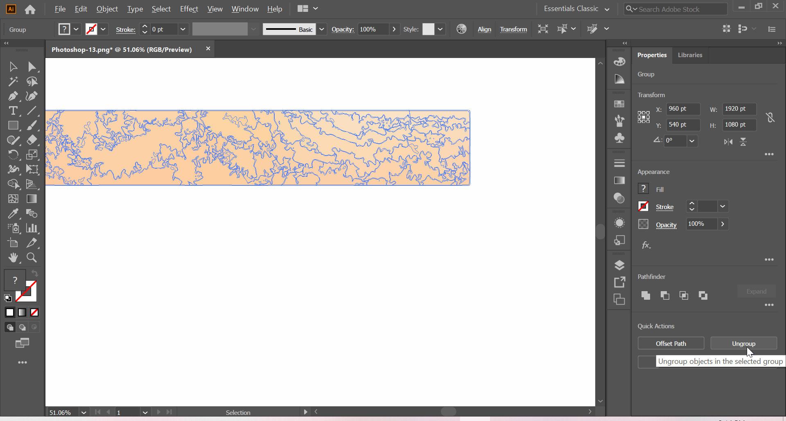

# Masking using AI and PS

## Procedure

I assume you have installed the [AI2ASS][].
If not do it.

Drag and drop the final mask image which
you have created in PS into the AI.
Make sure you have selected **Essentials Classic**
as work space.

_Work space_

Now click on _Image Trace_ which is present
in bottom of the right panel.
After selecting you will see number of options
in which select **High Fidilety Photo**.[^1]
There is some pre-processing that needs to be done so wait for it to get completed.
After that you should see a window like below.
Now click on _Expand_ in bottom of right panel.

_Expand_

After Expansion you should see blue lines
on image like below image.
Now click on _Ungroup_ in bottom of right panel.

_Ungroup_

Deselect the whole thing by clicking anywhere outside
the canvas and press _Ctrl+Shift+d_.[^2]
After that click on white background and press _Delete_.
If you didn't messed up you should see a clean image.

_Clean AI image_

Sometimes ImageTrace can create
**white spots around the edges**,
so it is better to do a sanity check to make sure
that there are no white spots around the edges.
Click on _Document Setup_ in bottom right.
In the pop up window select _Grid Colors_ option to _Custom_
and chose a color which is in contrast with the image.
I generally use green but use whatever color
is convienent for you.
And click ok.

_Grid colours_

Press _z_ to _Zoom_ and press _v_ to select the _Selection tool_
and click on any white spots and press _Delete_ to delete them.
This is how you should get at the end.

_Final image_

Sometimes there might be holes in the drawings,
genrally you can ignore it since they are only visible when zoomed out
but if it bothers you just click drawing around the hole
and drag the anchor/handles to fill it up.
After you are happy with the result _File-\>Scripts-\>AI2ASS_
to create the drawings.

_AI2ASS_

On the window click on Export button and wait till it is finished.
Now you can copy the result into subtitle and you should see the mask.

_Looks pretty, doesn't it?_

---

[^1]:
    If you see banding in the mask then try increasing the colors to max.
    But be aware this will create more lines in subtitle file.

[^2]: This will make the Grid background transparent.

[ai2ass]: https://github.com/TypesettingTools/AI2ASS
