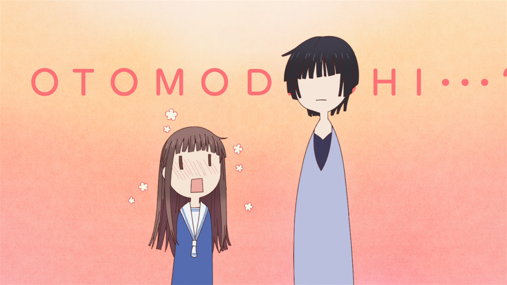
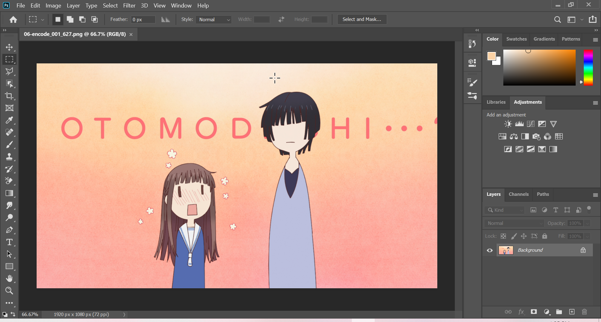
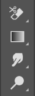
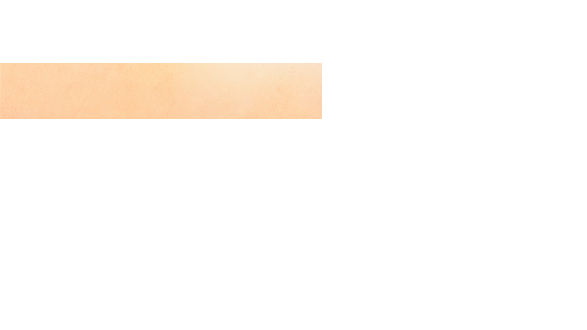

# Image Processing in PS

## Procedure

Before we start,
note that we will be doing all the grunt work in PS
while keeping AI usage to bare minimum.
If you are familiar with editing in PS,
you can skip this part and proceed to
[Image Tracing in AI](image-tracing.md).
If not, continue reading this guide
where I will show few essential tools to get you to speed
but for in depth editing and all the tools in PS,
refer tutorials online.

So on one fine day I was doing [Fruits Basket Final][] Ep.06
and suddenly I came across this abomination,
so I, the typesetting warrior
who has taken a vow to eliminate all Japanese in video,
decided to mask this.

_Raw Image_

If you look at the image carefully
you will notice
that there is a gradient radially
and also some sort of grain.
Masking this in Aegisub is a challenging and quite difficult,
so if you come across such masks
you can opt this method.

Open the image in PS (drag and drop it).
It will look something like this.

_Photoshop window_

Before we start our magic,
we need to remove the unnecessary part,
otherwise your script will be 100 MB.
Select the _Rectangular Marquee tool_[^1]
which is the second icon on the left side panel.

_Rectangular Marquee tool_

Draw a rectangle of what you want to mask,
_right click_ on the region,
and select _Select Inverse_.
I drew something like this.

_Select the area and inverse the selection_

After that, select _Eraser tool_
which is 12th icon from the top.

_Eraser tool_

By holding the button
you will get even more options.
Now, select the _Erase Tool_.

_Extra Eraser options_

After selecting,
press the right mouse button on the image.
You should see a pop up
where you increase the _Size_ parameter to the maximum.

_Eraser size_

Now select the _Eraser tool_ again,
but this time use the _Background Eraser_
and do the same thing as above.

_Background Eraser_

If you haven't messed up
you should be seeing something like this.

_Clean BG image_

Now we can start masking.
Select the _Rectangular Marquee tool_ around letter **O**
and select _Edit-\>Content-Aware Fill_.[^2]

_Fill_

You should see a pop-up like below
and click on _OK_.

_Fill options_

Afterwards, you should see a good mask.
If the mask is not to your linking,
redo the previous step and mess with the _Sampling Area Options_
until you are satisfied with the result.

_Masking_

There is something to keep in mind:
This will create a new layer by default
but you can change that option.
Regardless, make sure you are working on the _correct_ layer.

Follow the above steps until you yeeted all the Japanese.
Once you are satisfied, save this file as `.png`.

This was my final result,
which looks pretty good.

_Final Image_

That is all for PS part.
Now we can continue with AI.

---

[^1]: There are various another tools such as Lasso Tool, Polygonal Lasso Tool .etc to draw free hand areas.
[^2]: You can hotkey this.

[fruits basket final]: https://myanimelist.net/anime/42938/Fruits_Basket__The_Final
