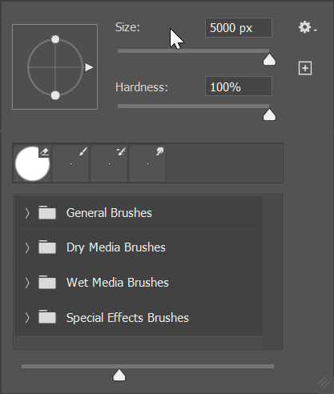
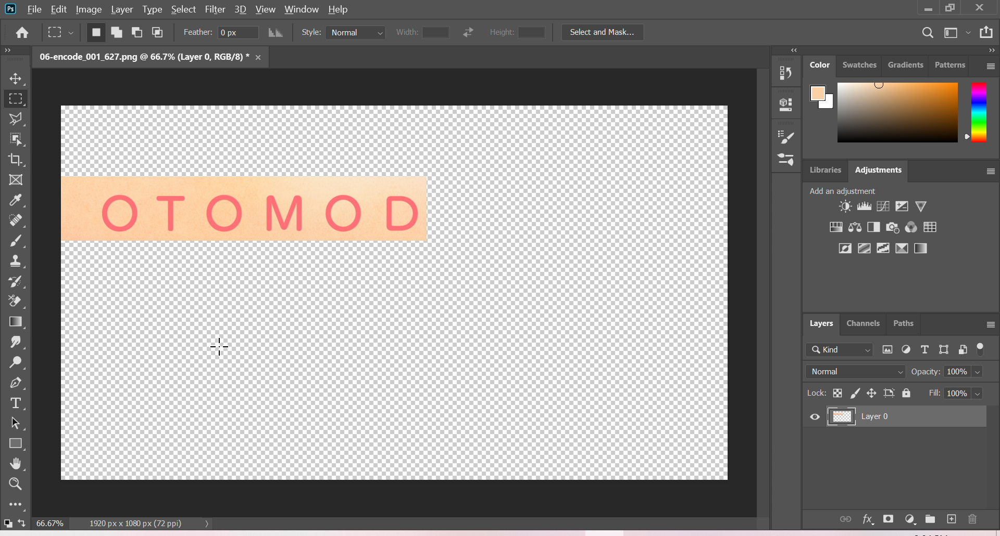

# Masking using AI and PS

## Procedure

Before we start, note that we will be doing all the grunt work in PS
while keeping AI usage to bare minimum.
If you are familiar with editing in PS,
you can skip this part and check
[Image Tracing in AI](image-tracing.md).
If not continue reading this guide
where I will show few essential tools to get you to speed
but for in depth editing and all the tools in PS,
refer tutorials online.

So on one fine day I was doing [Fruits Basket Final][] Ep.06
and suddenly I came across this abomination, so I,
the typesetting warrior who has taken a vow to eliminate
all Japanese in video decided to mask this.

_Raw Image_

If you look at the image carefully you will notice
that there is a gradient radially
and also some sort of grain.
So masking this in Aegisub is a
challenging and quite difficult.
So if you come across such masks,
you can opt this method.

Open the image in PS (Drag and drop it).
It will look something like this.

_Photoshop window_

Before we start our magic we need to remove the
unecessary part or else your
script will be 100mb
so select the _Rectangular Marquee tool_[^1]
which is the top 2nd icon on left side panel.

_Rectangular Marquee tool_

Draw a rectangle where you want to mask
and _right click_ on the region
and select _Select Inverse_.
I drew something like this.

_Select the area and inverse the selection_

After that select _Eraser tool_
which is 12th icon from the top.

_Eraser tool_

By holding the button you will get even more options,
and now select the _Erase Tool_.

_Extra Eraser options_

After selecting press right mouse button
on image, you should see
a pop up and increase the _Size_
parameter to max.

_Eraser size_

Now again select the _Eraser tool_ but this time use the
_Background Eraser_ and do the same thing as above.

_Background Eraser_

If you haven't messed up then you
should be seeing something like this.

_Clean BG image_

Now we can start masking.
Select the _Rectangular Marquee tool_ around letter **O**
and select _Content-Aware Fill_
via _Edit-\>Content-Aware Fill_.[^2]

_Fill_

You should see a pop-up like below and click on ok.

_Fill options_

You should see a good mask if not
try the above step and mess with the _Sampling Area Options_
until you are satisfied with the result.

_Masking_

There is something to keep in mind,
this will create a new layer by default
but you can change that option.
So make sure you are on _correct_ layer.
Follow the above steps until you yeet all the Japanese.
Now save this file as .png
and this was my final result which looks pretty good.

_Final Image_

That is it for PS part.
Now we can go to AI.

---

[^1]: There are various another tools such as Lasso Tool, Polygonal Lasso Tool .etc to draw free hand areas.
[^2]: You can hotkey this.

[fruits basket final]: https://myanimelist.net/anime/42938/Fruits_Basket__The_Final
