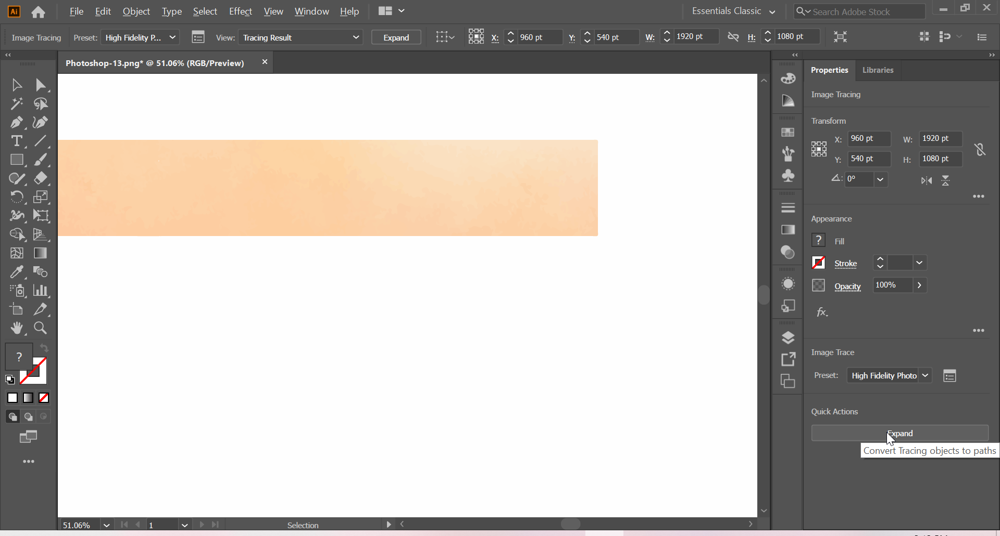
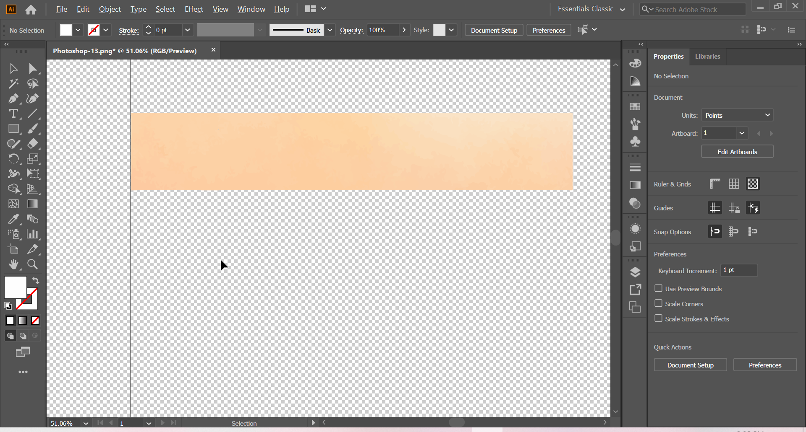

# Image Tracing in AI

## Procedure

I assume you have installed [AI2ASS][].
If not, do it now.

Drag and drop the final mask image
which you have created in PS
into AI.
Make sure you have selected **Essentials Classic**
as your work space.

_Work space_

Now click on _Image Trace_
which can be found in the bottom of the right panel.
After selecting, you will see a number of options
in which you select **High Fidilety Photo**.[^1]
There is some pre-processing that needs to be done,
so wait for it to be completed.
After that you should see a window like below.
Click on _Expand_ at the bottom of right panel.

_Expand_

After Expansion
you should see blue lines on image like pictured below.
Now click on _Ungroup_,
again at the bottom of right panel.

_Ungroup_

Deselect the whole thing
by clicking anywhere outside the canvas
and press <kbd>Ctrl+Shift+D</kbd>.[^2]
Afterwards, click on the white background and press _Delete_.
If you didn't messed up,
you should see a clean image.

_Clean AI image_

Sometimes ImageTrace can create
**white spots around the edges**,
so it is better to do a sanity check
and make sure that there are no white spots around the edges.

Click on _Document Setup_ in the bottom right.
In the pop-up window.
select _Grid Colors_ option to _Custom_
and choose a color that is in contrast with the image.
I generally use green
but you may use whatever color is convenient for you.
Confirm your choice by clicking on _OK_.

_Grid colours_

Press <kbd>Z</kbd> to _Zoom_
and press <kbd>V</kbd> to activate the _Selection tool_.
Click on any white spots and press _Delete_ to delete them.
This is what you should see at the end.

_Final image_

Sometimes there might be holes in the drawings.
Generally you can ignore those
since they are only visible when zoomed out,
but if it bothers you
just click drawing around the hole
and drag the anchor/handles to fill it up.
Once you are happy with the result,
select _File → Scripts → AI2ASS_ to create the ASS drawings.

_AI2ASS_

On the window,
click on _Export_ and wait till it is finished.
Now you can copy the result into your subtitle script
and you should see the mask.

_Looks pretty, doesn't it?_

---

[^1]: If you see banding in the mask,
try increasing the colors to max.
However, note that this will create more lines in subtitle file.

[^2]: This will make the grid background transparent.

[ai2ass]: https://github.com/TypesettingTools/AI2ASS
