# Masking using AI and PS
## Procedure

Before we start, note that we will be
doing all the grunt work in PS while keeping
AI usage to bare minimum.
If you are familiar with editing in PS, 
you can skip this part and check 
[Image Tracing in AI](imageTrace.md).
If not continue reading this guide
where I will show few essential tools to get you to speed 
but for in depth editing and all the tools in PS, 
refer tutorials online.

So on one fine day I was doing [Fruits Basket Final][] Ep.06 
and suddenly I came across this abomination, so I,
the typesetting warrior who has taken a vow to eliminate 
all Japanese in video decided to mask this.

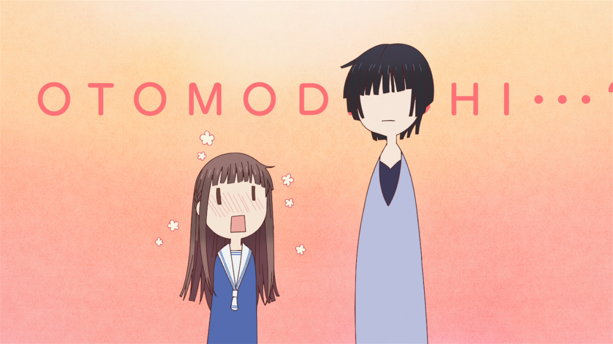
*Raw Image*

If you look at the image carefully you will notice 
that there is a gradient radially 
and also some sort of grain.
So masking this in Aegisub is a 
challenging and quite difficult. 
So if you come across such masks,
you can opt this method.

Open the image in PS (Drag and drop it).
It will look something like this.

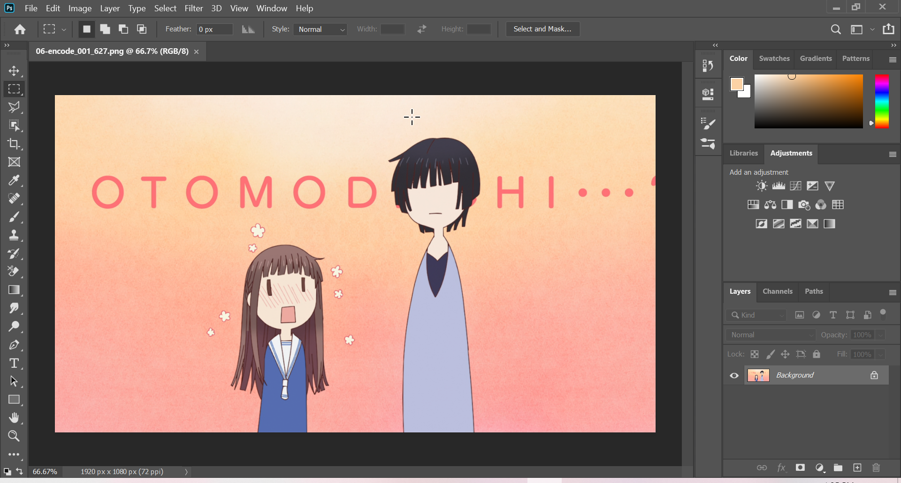
*Photoshop window*

Before we start our magic we need to remove the 
unecessary part or else your
script will be 100mb
so select the *Rectangular Marquee tool*[^1]
which is the top 2nd icon on left side panel.

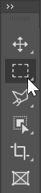
*Rectangular Marquee tool*

Draw a rectangle where you want to mask 
and *right click* on the region 
and select *Select Inverse*. 
I drew something like this. 

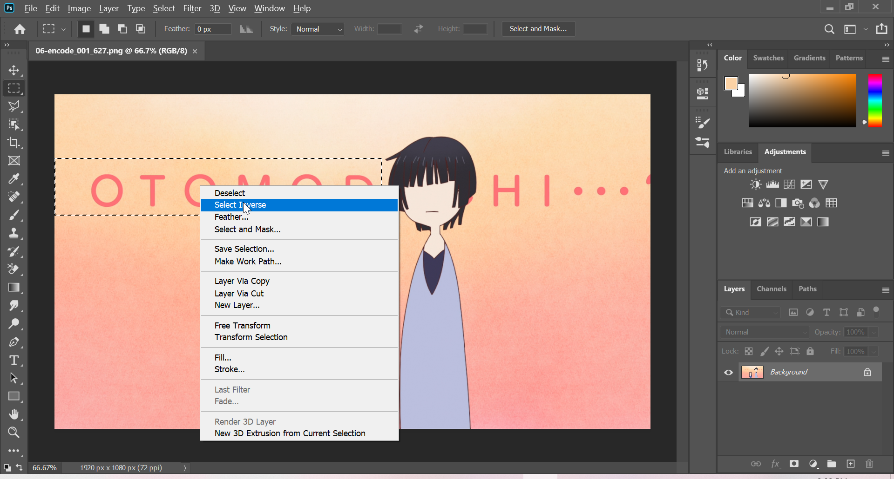
*Select the area and inverse the selection*

After that select *Eraser tool* 
which is 12th icon from the top.

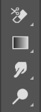 
*Eraser tool*

By holding the button you will get even more options, 
and now select the *Erase Tool*.

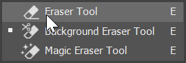
*Extra Eraser options*

After selecting press right mouse button
on image, you should see 
a pop up and increase the *Size*
parameter to max. 

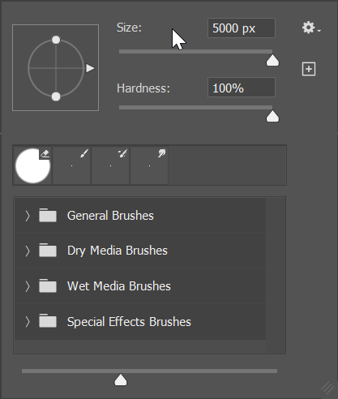
*Eraser size*

Now again select the *Eraser tool* but this time use the
*Background Eraser* and do the same thing as above.

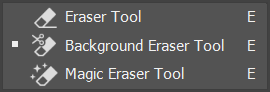
*Background Eraser*

If you haven't messed up then you 
should be seeing something like this.

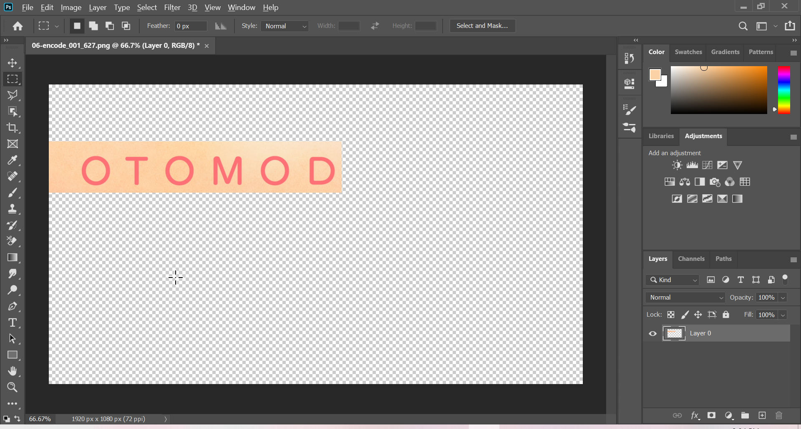
*Clean BG image*

Now we can start masking. 
Select the *Rectangular Marquee tool* around letter **O**
and select *Content-Aware Fill* 
via *Edit-\>Content-Aware Fill*.[^2]

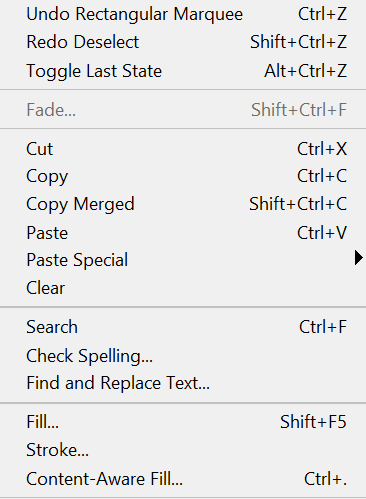
*Fill*

You should see a pop-up like below and click on ok. 

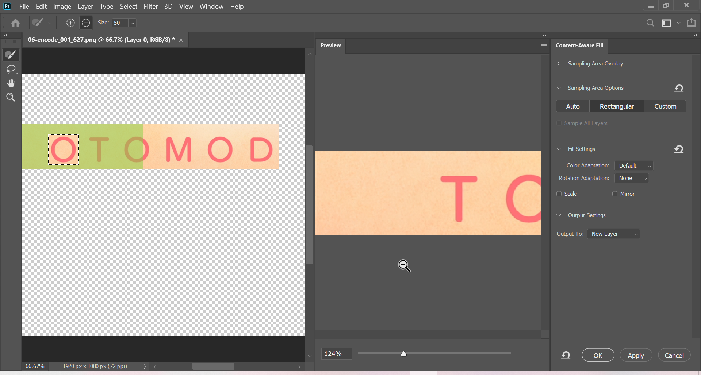
*Fill options*

You should see a good mask if not 
try the above step and mess with the *Sampling Area Options* 
until you are satisfied with the result.

*Masking*

There is something to keep in mind, 
this will create a new layer by default 
but you can change that option. 
So make sure you are on *correct* layer. 
Follow the above steps until you yeet all the Japanese.
Now save this file as .png 
and this was my final result which looks pretty good. 

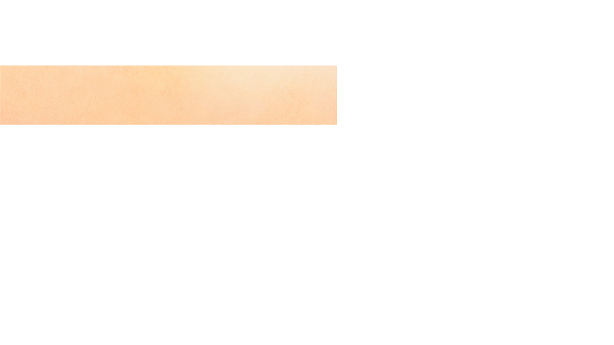
*Final Image*

That is it for PS part. 
Now we can go to AI.

***

[^1]: There is various another tools such as Lasso Tool, Polygonal Lasso Tool .etc to draw free hand areas.

[^2]: You can hotkey this.

[Fruits Basket Final]: https://myanimelist.net/anime/42938/Fruits_Basket__The_Final
