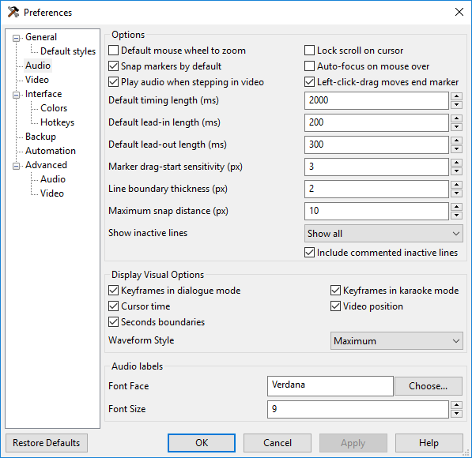
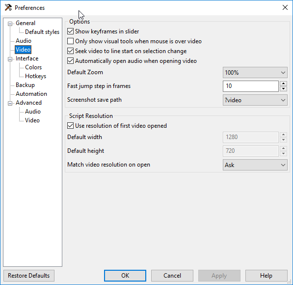

# Aegisub & Other Tools

## Tools

The first thing you'll need to do is make sure your tools are in order.
Typesetters will need more tools than most other roles in fansubbing and
they need to be configured properly.

Here is a list of tools you will want to download:

  - [Aegisub][]
      - It is **highly** recommended to use [line0's builds][] which
        include a preinstalled automation script package manager built
        by fansubbers called Dependency Control and several *critical*
        fixes to Aegisub that have not been merged into the official
        application.
  - A font manager
      - Not all font managers are equal. Choose the one that works the
        best for you. Some important features might include:
          - Performance with large font libraries.
          - Add fonts from folders, not just installed fonts.
          - Activate fonts for use without installing.
          - Organize fonts in a meaningful way.
          - Works on your OS.
      - Free Options
          - [Nexusfont][]
          - [FontBase][]
      - Paid (Note: can be found free on *certain websites)*
          - [MainType][]
          - [Suitcase Fusion][]
  - Software for motion-tracking
      - Option 1: [Mocha Pro standalone app][]
        - Look for it on *certain websites*.
        - On Windows, Mocha **requires** [Quicktime][] to be installed.
          More information can be found [here][quicktimeFAQ]
      - Option 2: [Blender][][^1]
        - Requires a plug-in that will be discussed in a later section.
  - [x264 binary][][^2]
      - Download the latest **8-bit** binary for your platform.
      - For example: x264-r2851-ba24899.exe
        **not** x264-10b-r2851-ba24899.exe
      - 32-bit builds on Windows may be more stable.
  - [Adobe Photoshop and Illustrator][]
      - Look for it on *certain websites*.
      - Alternatively, free software like
        [Gimp][] and
        [Inkscape][] may be used in some
        circumstances.

[Aegisub]: http://www.aegisub.org
[Nexusfont]: http://www.xiles.net
[FontBase]: http://fontba.se
[MainType]: http://www.high-logic.com/font-manager/maintype.html
[Suitcase Fusion]: https://www.extensis.com/products/font-management/suitcase-fusion/
[Mocha Pro standalone app]: https://www.imagineersystems.com/products/mocha-pro/
[Quicktime]: https://support.apple.com/kb/DL837?locale=en_US
[quicktimeFAQ]: http://www.imagineersystems.com/support/support-faq/#quicktime-on-windows
[Blender]: https://www.blender.org/download/
[x264 binary]: https://download.videolan.org/x264/binaries/
[Adobe Photoshop and Illustrator]: http://www.adobe.com/creativecloud.html
[Gimp]: https://www.gimp.org
[Inkscape]: https://inkscape.org/en/
[line0's builds]: https://files.line0.eu/builds/Aegisub/

## Configuring Aegisub

For now, just change your settings to reflect the following. If you've
made any changes previously for another fansub role, be careful not to
overwrite those. When in doubt, ask someone with Aegisub experience.
Settings can be accessed via *View \> Options* or with the hotkey *Alt +
O*.

The *Advanced \> Video* options include two particularly important
settings.

1.  "Force BT.601" Checkbox. This option is enabled by default. For
    fansubbing, ***this is bad***. At least it is in most cases. If you
    want a more in depth explanation of color matrices and how these two
    are different, you can read up
    [here][bt601-vs-bt709],
    but the gist of it is this: BT.601 is for Standard Definition video
    and BT.709 is for High Definition video[1](#fn1).
    Opening a .ass file in
    Aegisub with the default set to BT.601 could *irreversibly ruin the
    colors of any typesetting, dialogue, or kfx already in the script*.
    Even worse, some video renderers will read this setting from the
    muxed subtitles and render the video to match it. So
    please, *please*, ***please*** change it now.

    1.  If you are working on a DVD or something in Standard Definition,
        you can change this to BT.601 manually in *File \> Script
        Properties*.

        1.  Not all Standard Definition video will be BT.601, so when in
            doubt, ask the encoder or check
            [MediaInfo][] if they are
            not available.
        2.  You will almost always want to use TV.601 and not PC.601.
            Once again, if in doubt, ask the encoder.

    2.  It's also recommended that before you start working on a script,
        check that the color matrices are correct in *File \> Script
        Properties*.

        1.  You will almost always want to use TV.709 and not PC.709.
            Once again, if in doubt, ask the encoder or
            check MediaInfo if
            they are not available.

    

[Standard Definition]: https://en.wikipedia.org/wiki/Standard-definition_television
[High Definition]: https://en.wikipedia.org/wiki/High-definition_video
[BT.601]: https://en.wikipedia.org/wiki/Rec._601
[BT.709]: https://en.wikipedia.org/wiki/Rec._709

[bt601-vs-bt709]: http://blog.maxofs2d.net/post/148346073513/bt601-vs-bt709
[MediaInfo]: https://mediaarea.net/en/MediaInfo

The "Subtitles Provider".

1.  Just a few years ago, there was a pretty clear consensus on which
    subtitle renderer to use for anime and softsubs. These days, not so
    much.
2.  It used to be that
    [VSFilter][] was
    the best renderer around and was the only supported renderer by most
    fansub groups.
3.  However, it was eventually replaced
    with [xy-vsfilter][] and
    then that was replaced
    with [xySubFilter][]
    because VSFilter and xy-vs filter were not keeping up with the
    demands of subtitles.
4.  By 2015, however, xySubFilter development had come to a halt and
    since then, [libass][] has made many
    improvements both in speed and compatibility with advanced
    subtitling in part due to contributions from members of the fansub
    community.
5.  At the end of the day, which renderer you choose is up to you, but
    we recommend libass. It is maintained, cross-platform, able to handle
    most typesetting, and has been integrated into many commercial and
    open source software products. If you prefer, however, stock Aegisub
    ships with VSFIlter and line0's builds come with xy-vsfilter.

[libass]: https://github.com/libass/libass
[VSFilter]: https://sourceforge.net/projects/guliverkli/files/VSFilter/
[xy-vsfilter]: https://forum.doom9.org/showthread.php?t=168282
[xySubFilter]: https://forum.doom9.org/showthread.php?t=168282

### Hotkeys

As you develop your skills more and begin to integrate automation
scripts into your workflow, you will probably want to consider adding
hotkeys to cut down on time navigating menus. These can be accessed via
*Interface \> Hotkeys* in Aegisub's Options menu. We'll let you decide
on those yourself, however, and move on for now.

***

<b name="fn1">1</b>: For further reading on this, visit the wikipedia pages for
[^1]: Most if not all fansubbers use Mocha for motion-tracking,
but the author of the motion-tracking page prefers the free software Blender,
which may be easier for some to acquire.
[Standard Definition][] video, [High Definition][] video, and the [BT.601][]
and [BT.709][] color spaces. [↩](#a1)
